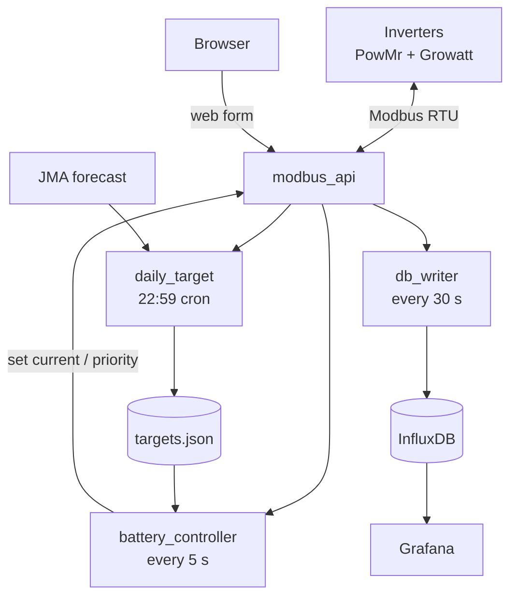

# srne-solar-controller

Charge controller and Modbus logger for a hybrid-inverter setup on a Raspberry Pi.
Reads battery state, looks at tomorrow's weather forecast, and only buys grid
electricity when it actually needs to.

Personal project — built around my own hardware (PowMr SunSmart-10KP, Growatt SPF6000ES Plus,
520 Ah LFP, JST tariff window). Other Modbus inverters can probably be supported by editing
`regmap.yaml` and the address constants in `modbus_api.py`.

## What it does

- Polls both inverters over Modbus every 5 s (battery state) and 60 s (everything else).
- At 22:59 each night, fetches the JMA forecast for tomorrow and computes how much overnight
  charge is needed to cover the expected solar shortfall.
- During the cheap-power window, runs a state machine (`UTI_CHARGING` ↔ `UTI_STOPPED` ↔ `SBU`)
  and tapers charge current as voltage rises.
- Writes every register to InfluxDB; Grafana dashboards in `grafana/provisioning/`.
- Web form for adjusting target SOC / charge current / full-charge flag, plus a manual
  override that pins a state for 60 min.



`modbus_api` owns both serial ports; everyone else talks HTTP. `targets.json` is the
hand-off between the nightly planner and the live controller.

## Setup

```bash
git clone https://github.com/sadaoikebe/srne-solar-controller.git
cd srne-solar-controller
cp .env.example .env       # edit
docker compose up -d --build
```

Minimum `.env`:

```dotenv
TZ=Asia/Tokyo
USERNAME=admin
PASSWORD=...
INFLUX_ORG=solar
INFLUX_BUCKET=mysolardb
INFLUX_TOKEN=...
```

- Web form: `http://<pi>:5004/set_targets_form`
- Grafana:  `http://<pi>:3000`

## Updating

```bash
git pull
docker compose up -d --build
```

`up -d --build` only rebuilds the image when source has changed and only recreates
containers whose config or image changed.

## Manual override

Pick `UTI_CHARGING` / `UTI_STOPPED` / `SBU` from the override dropdown to pin the state
for 60 min. The state machine is bypassed, but safety limits (voltage taper, grid-power
budget) still apply. Submit again to extend; pick `Auto` to clear.

## Optional: host reboot button

Disabled by default — the "Restart Host" button on the form is just a label until you
opt in:

```bash
sudo bash scripts/install-host-reboot.sh
docker compose up -d
```

This adds a systemd path unit that watches `/var/lib/srne-reboot/reboot-requested`.
The container can only *create* the trigger file; rebooting requires root and only the
host ever has it. There's a 60-minute cooldown between reboots so a buggy container
can't loop the host. History: `journalctl -t srne-reboot`.

To force one reboot through the cooldown:

```bash
sudo rm /var/lib/srne-reboot/last-reboot
```

To remove the whole thing:

```bash
sudo bash scripts/uninstall-host-reboot.sh
docker compose up -d
```

## Files

| File | Role |
|---|---|
| `modbus_api.py` | FastAPI bridge — owns both serial ports |
| `battery_controller.py` | 5 s charge-control loop, state machine |
| `daily_target.py` | Nightly planner (JMA → target SOC → charge current) |
| `db_writer.py` | Register dump → InfluxDB every 60 s |
| `regmap.yaml` | Register address, name, unit, scale (edit to add metrics) |
| `targets.json` | Runtime state shared between daily_target and battery_controller |

## License

MIT.
