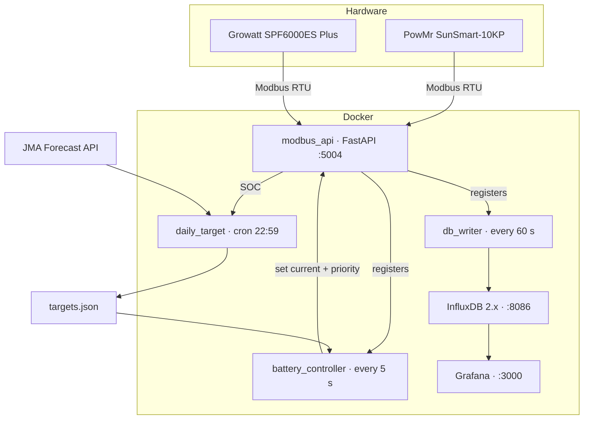
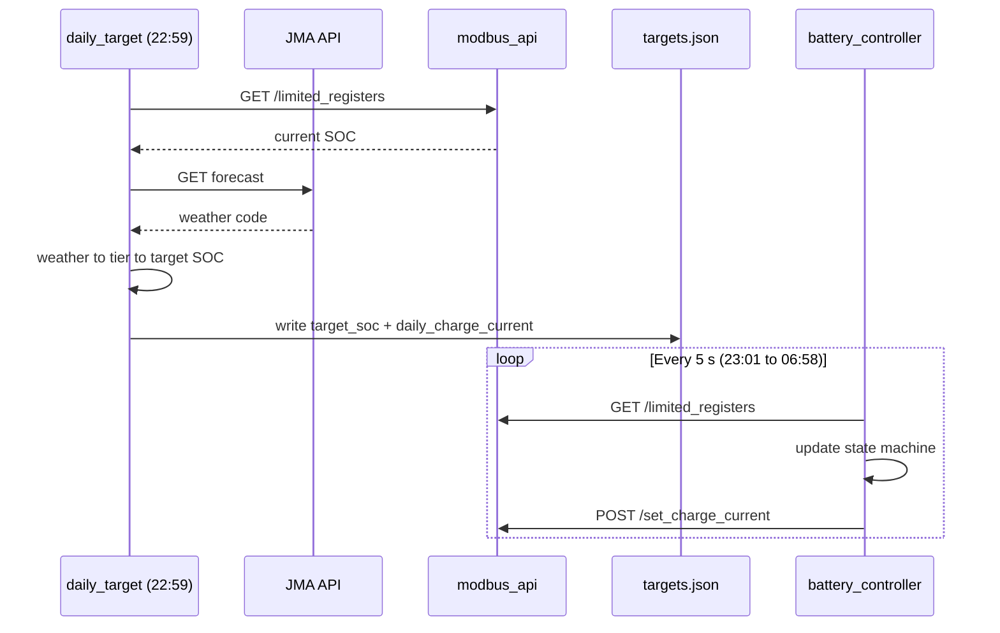

# srne-solar-controller

[](https://www.python.org/)
[](https://docs.docker.com/compose/)
[](https://www.influxdata.com/)
[](https://www.raspberrypi.org/)
[](LICENSE)

**Weather-adaptive battery charge controller and solar monitor for hybrid inverter setups, running on a Raspberry Pi.**

Fetches tomorrow's weather forecast each evening, calculates the minimum overnight charge needed to cover the next day's solar shortfall, and controls the inverter in real time over Modbus RTU — so you only buy the grid electricity you actually need.

---

## Features

- **Weather-adaptive nightly planning** — queries JMA forecast API at 22:59, maps weather to a target SOC by month and sun tier, calculates the exact charge current needed to reach it by 05:30
- **5-second charge control loop** — state machine switches between `UTI_CHARGING`, `UTI_STOPPED`, and `SBU`; tapers current automatically as battery voltage rises
- **Dual-inverter Modbus bridge** — polls PowMr (holding registers, hex-addressed) and Growatt (input registers, decimal-addressed) through a single FastAPI service that owns both serial ports
- **InfluxDB v2 + Grafana** — all registers written every 60 s; field names, units, and scale factors defined in `regmap.yaml` with no code changes needed to add metrics
- **Manual override UI** — HTTP form at `/set_targets_form` (Basic Auth) to change target SOC or charge current mid-day

---

## Quick Start

```bash
git clone https://github.com/sadaoikebe/srne-solar-controller.git
cd srne-solar-controller
cp .env.example .env   # edit values below
docker compose up -d --build
```

**.env** (minimum required values):

```dotenv
TZ=Asia/Tokyo
USERNAME=admin
PASSWORD=yourpassword
INFLUXDB2_ORG=solar
INFLUXDB2_BUCKET=mysolardb
INFLUXDB2_TOKEN=your-long-random-token
```

Verify it is running:

```bash
curl http://localhost:5004/limited_registers
# {"0x0100": 87, "0x0101": 534, "0x0102": 65300, "0x021c": 412, "0x0234": 388}
```

Grafana: `http://<pi-ip>:3000` — log in with `USERNAME` / `PASSWORD`.

---

## Architecture



`modbus_api` is the single owner of both serial ports — all other services talk to it over HTTP, avoiding port conflicts.

---

## Nightly Planning Flow



---

## Usage

**Manually recalculate tonight's charging plan:**

```bash
docker exec -it daily_target python /app/daily_target.py

# With overrides
docker exec -it daily_target python /app/daily_target.py --target-soc 70 --until-time 04:00
docker exec -it daily_target python /app/daily_target.py --dry-run
```

**Override targets via browser:**

```
http://<pi-ip>:5004/set_targets_form
```

**Read inverter state:**

```bash
curl http://localhost:5004/get_output_priority
curl http://localhost:5004/registers | python3 -m json.tool
```

---

## Project Structure

```
├── modbus_api.py          # FastAPI bridge — owns serial ports, exposes REST API
├── battery_controller.py  # 5 s control loop — state machine + charge current tapering
├── daily_target.py        # Nightly planner — weather → SOC target → charge current
├── db_writer.py           # Data logger — register dump → InfluxDB every 60 s
├── regmap.yaml            # Register map — address, field name, unit, scale per inverter
├── targets.json           # Runtime config — shared between daily_target and battery_controller
├── crontab                # supercronic schedule (22:59 daily)
├── compose.yaml           # Six-service Docker Compose stack
├── Dockerfile             # python:3.11-slim + tini + supercronic (aarch64)
└── set_targets.html       # Jinja2 template for the web override form
```

---

## Prerequisites

| Requirement | Notes |
|---|---|
| Raspberry Pi (aarch64) | Ubuntu 64-bit or Raspberry Pi OS 64-bit |
| Docker + Compose v2 | `docker compose` plugin, not legacy `docker-compose` |
| Two USB–RS485 adapters | One per inverter |

> **x86-64 / dev machines:** change `supercronic-linux-arm64` to `supercronic-linux-amd64` in `Dockerfile`.

---

## Design Notes

- **`estimated_soc`** — the inverter reports SOC as a whole-number percent. The controller integrates battery current (520 Ah, 5 s intervals) to track sub-integer SOC for smooth transitions.
- **`daily_charge_current`** — the inverter has no "stop at SOC X" command. `daily_target.py` converts the SOC target into the current required to reach it within the charging window.
- **`regmap.yaml`** — adding a new metric is one line of YAML; no Python changes needed.
- **`tini` + `supercronic`** — `tini` ensures clean signal forwarding on shutdown; `supercronic` runs cron inside the container with correct timezone support and stdout logging.

---

## Optional: Host Reboot Button

By default, the controller cannot reboot the Raspberry Pi — the "Restart Host"
button in the targets form returns *not enabled*. To turn it on:

```bash
sudo bash scripts/install-host-reboot.sh
docker compose up -d
```

The install script drops a tiny systemd path unit on the host that watches
`/var/lib/srne-reboot/reboot-requested`. The container can only *create* that
file — it never has `CAP_SYS_BOOT` or root on the host. To opt out:

```bash
sudo bash scripts/uninstall-host-reboot.sh
docker compose up -d
```

---

## Roadmap

- [ ] Parameterize JMA area code and TOU window via environment variables (currently hardcoded for Kansai)
- [ ] Bundle a Grafana dashboard JSON in `provisioning/` for zero-config panel setup
- [ ] Morning accuracy log — compare planned vs. actual SOC at 06:00 to track battery degradation over time
- [ ] Notification support (ntfy / Telegram) when daytime SOC drops below a configured floor

---

## Hardware Reference

Developed and tested with:

| Component | Model |
|---|---|
| Primary inverter | PowMr SunSmart-10KP (split-phase) |
| Secondary inverter | Growatt SPF6000ES Plus |
| Controller | Raspberry Pi (Linux aarch64) |
| Solar | ~12.47 kW peak |
| Battery | 2× JK-BMS XR-07, 32× 300 Ah LFP — 520 Ah @ 48 V |

Other Modbus-capable hybrid inverters can be supported by editing `regmap.yaml` and the address constants in `modbus_api.py`.

---

## License

MIT — see [LICENSE](LICENSE).
