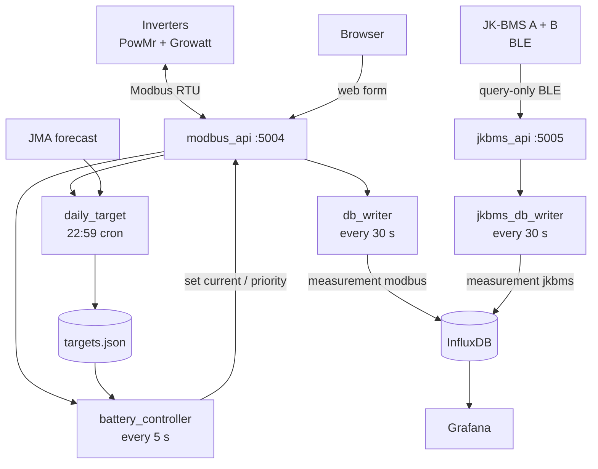

# srne-solar-controller

Charge controller and telemetry stack for a hybrid-inverter + LFP battery setup
on a Raspberry Pi.

Personal project — built around my own hardware (PowMr SunSmart-10KP, Growatt
SPF6000ES Plus, dual JK-BMS 16S banks, JST tariff window). Other Modbus
inverters can usually be supported by editing `regmap.yaml` and the address
constants in `modbus_api.py`.

## What it does

- Polls both inverters over Modbus RTU (battery state every **5 s** for control;
  full register dump every **30 s** for logging).
- Polls two **JK-BMS** units over **Bluetooth LE** every **30 s** (cell voltages,
  SoC, current, temps, …) — query-only, no BMS control.
- At 22:59 each night, fetches the JMA forecast for tomorrow and computes how
  much overnight charge is needed to cover the expected solar shortfall.
- During the cheap-power window, runs a state machine
  (`UTI_CHARGING` ↔ `UTI_STOPPED` ↔ `SBU`) and tapers charge current as voltage
  rises.
- Writes to InfluxDB; Grafana dashboards under `grafana/provisioning/`.
- Web form for target SoC / charge current / full-charge flag, plus a manual
  override that pins a state for 60 min.


```mermaid
graph TD
    INV[Inverters<br/>PowMr + Growatt]
    BMS[JK-BMS A + B<br/>BLE]
    JMA[JMA forecast]
    USER[Browser]

    INV <-->|Modbus RTU| API[modbus_api :5004]
    BMS -->|query-only BLE| JB[jkbms_api :5005]
    USER -->|web form| API

    API --> BC[battery_controller<br/>every 5 s]
    API --> DW[db_writer<br/>every 30 s]
    API --> DT[daily_target<br/>22:59 cron]
    JB --> JW[jkbms_db_writer<br/>every 30 s]
    BC -->|set current / priority| API

    JMA --> DT
    DT --> TJ[(targets.json)]
    TJ --> BC

    DW -->|measurement modbus| IF[(InfluxDB)]
    JW -->|measurement jkbms| IF
    IF --> GF[Grafana]
```

`modbus_api` owns both USB serial ports; `jkbms_api` owns BLE. Everyone else
talks HTTP (or writes Influx). `targets.json` is the hand-off between the
nightly planner and the live controller.

## Setup

```bash
git clone https://github.com/sadaoikebe/srne-solar-controller.git
cd srne-solar-controller
cp .env.example .env       # edit secrets + org/bucket
docker compose up -d --build
```

Minimum `.env` (see `.env.example`):

```dotenv
TZ=Asia/Tokyo
USERNAME=admin
PASSWORD=...
INFLUX_ORG=solar
INFLUX_BUCKET=mysolardb
INFLUX_TOKEN=...
```

| URL | Service |
|-----|---------|
| `http://<pi>:5004/set_targets_form` | Charge targets web form |
| `http://<pi>:5005/health` | JK-BMS API health (local) |
| `http://<pi>:3000` | Grafana |
| `http://<pi>:8086` | InfluxDB |

### JK-BMS / Bluetooth

- Host BlueZ must be running (`systemctl status bluetooth`).
- Bank MACs/serials: `jkbms.yaml`.
- **Close the JK-BMS phone app** while the Pi is polling — BLE is single-client.
- Grafana: **JK-BMS Battery Banks** →  
  `http://<pi>:3000/d/solar-jkbms/jk-bms-battery-banks`

## Influx measurements

| Measurement | Source | Cadence |
|-------------|--------|---------|
| `modbus` | Inverter registers via `db_writer` + `regmap.yaml` | 30 s |
| `jkbms` | BMS snapshot via `jkbms_db_writer` | 30 s |

Optional Growatt **raw** dump (`modbus_raw` in a separate bucket) is **off** by
default. Set `INFLUX_BUCKET_RAW=solar_raw` in `.env` and recreate `db_writer`
only if you need wire-level register archaeology again.

## Updating

```bash
git pull
docker compose up -d --build
```

`up -d --build` only rebuilds the image when source has changed and only
recreates containers whose config or image changed.

## Manual override

Pick `UTI_CHARGING` / `UTI_STOPPED` / `SBU` from the override dropdown to pin
the state for 60 min. The state machine is bypassed, but safety limits
(voltage taper, grid-power budget) still apply. Submit again to extend; pick
`Auto` to clear.

## Optional: host reboot button

Disabled by default — the "Restart Host" button on the form is just a label
until you opt in:

```bash
sudo bash scripts/install-host-reboot.sh
docker compose up -d
```

This adds a systemd path unit that watches `/var/lib/srne-reboot/reboot-requested`.
The container can only *create* the trigger file; rebooting requires root and
only the host ever has it. History: `journalctl -t srne-reboot`.

```bash
sudo rm /var/lib/srne-reboot/last-reboot   # force through cooldown
sudo bash scripts/uninstall-host-reboot.sh # remove
docker compose up -d
```

## Files

| File | Role |
|------|------|
| `modbus_api.py` | FastAPI bridge — owns both serial ports |
| `battery_controller.py` | 5 s charge-control loop, state machine |
| `daily_target.py` | Nightly planner (JMA → target SoC → charge current) |
| `db_writer.py` | Inverter registers → Influx (`modbus`) every 30 s |
| `jkbms_api.py` | JK-BMS BLE cache API (query-only, port 5005) |
| `jkbms_client.py` | BLE read-only protocol helpers |
| `jkbms_db_writer.py` | BMS snapshot → Influx (`jkbms`) every 30 s |
| `jkbms.yaml` | BMS bank MAC / serial map |
| `regmap.yaml` | Register address → name / unit / scale |
| `targets.json` | Runtime state (planner ↔ controller) |
| `grafana/provisioning/` | Dashboards + Influx datasource |

## License

MIT.
