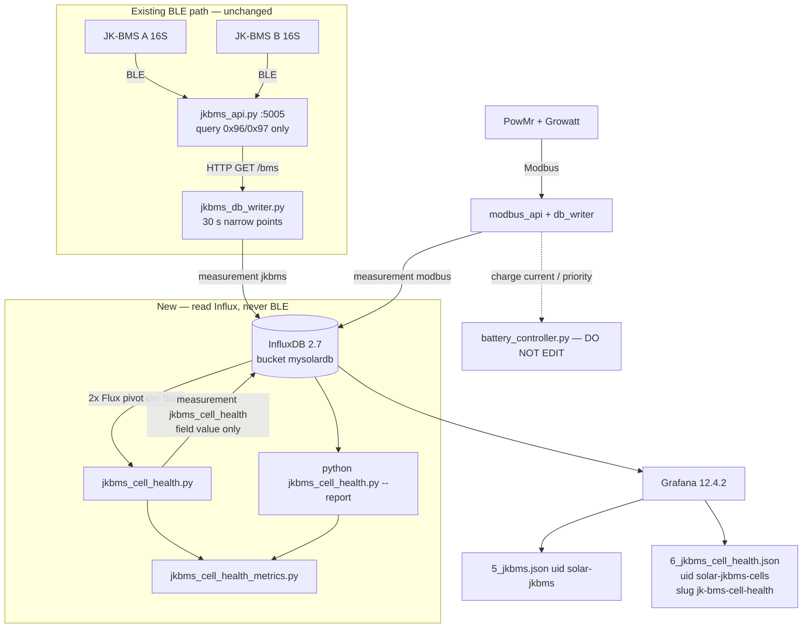
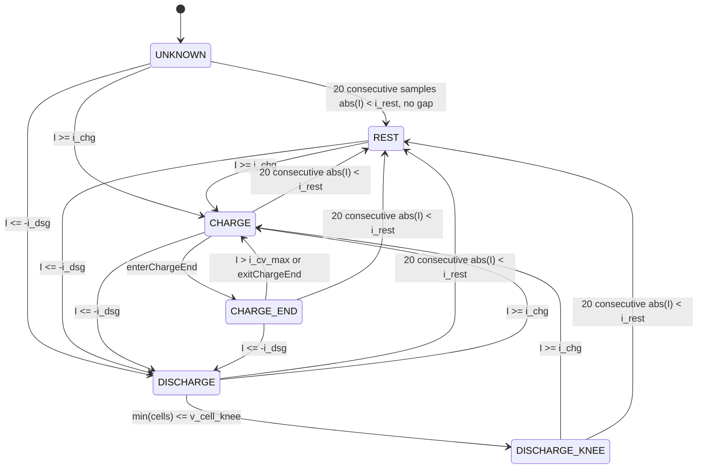
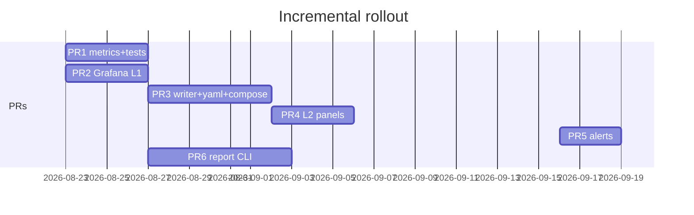

# Per-cell LFP Health Diagnostics for Dual JK-BMS Banks

| Field | Value |
| --- | --- |
| **Title** | Per-cell LiFePO4 health diagnostic tool (`srne-solar-controller`) |
| **Author** | srne-solar-controller maintainer |
| **Date** | 2026-08-22 (revised) |
| **Status** | Draft (open questions resolved) |
| **Repo** | `/home/shobon/srne-solar-controller/` |
| **Audience** | Maintainers of this Pi-hosted off-grid stack |
| **Chemistry** | LiFePO4 (LFP) only — not NMC / NCA / LCO / lead-acid |

---

## Overview

This house has two parallel 16S LFP banks (32 cells), each behind a JK-BMS. Since the BLE collector landed, Influx already stores pack current/voltage/SoC and **every cell voltage** at 30 s (`measurement: jkbms`). The existing Grafana dashboard (`grafana/provisioning/dashboards/5_jkbms.json`, uid `solar-jkbms`, slug `jk-bms-battery-banks`) plots those voltages as **A01–A16 / B01–B16**. The user has seen cell **A06** sit off the pack, wonders whether bank B is “healthier,” and wants a tool to inspect **per-cell** condition — not just pack SoC / the BMS’s pack-level `soh` integer.

**Short answers, before any software:**

1. **Canonical cell health is remaining capacity**, \(SOH_Q = Q_\text{actual}/Q_\text{nominal}\). A resistance-based \(SOH_R\) (DCIR growth) is a related but **not equivalent** metric. There is **no** valid single “cell health %” computable from a mid-SoC voltage offset, and the L2 writer **must not** write a ratio named `soh_*`.
2. **LFP open-circuit voltage is extremely flat** (~3.20–3.35 V) from roughly 10–90 % SoC. A persistent mid-SoC offset on A06 is **not**, by itself, evidence of capacity fade. Diagnose by *when* the deviation appears (rest / load-charge / load-discharge / charge-end).
3. **“Bank B looks healthy” can only be relative** (tighter `cell_delta`, less sticky min/max identity). Without a deep/full discharge and coulomb counting between voltage landmarks, it is **not** a numeric \(SOH_Q\) claim. We have fully charged; we have **not** observed a discharge knee.
4. **What we can compute now** (proxies, not SoH%): residual vs **median**, outlier identity persistence, rest vs **sign-split** load residual, end-of-charge ranking, 30 s-step \(\Delta V/\Delta I\) (polarization + interconnect, not pulse DCIR), balance participation. Pack BMS `soh` / `cycles` / `remain_ah` are context only.
5. **What we cannot claim until a wide SoC sweep exists:** per-cell \(SOH_Q\), ICA (\(dQ/dV\)), DVA (\(dV/dQ\)). Those remain a **gated L3 CLI**. **No deep discharge is scheduled** (K22); \(SOH_Q\) stays unavailable. Landmark \(t^\text{full}_i\) is the **first** time cell \(i\) hits `V_cell_charge_end`, not the last sample of the CV window.

**Proposed tool:** do **not** add a web app or a second database. (a) New Grafana dashboard on existing `jkbms` — L1 residual uses **two Flux queries + Grafana transformations** (this repo never uses Flux `join()`; see `1_realtime.json` / `2_graphs.json` `pivot`). (b) Small Python job in the same image as `jkbms_db_writer.py` that **pivots** split Influx points back into `PackSample`s and writes measurement `jkbms_cell_health` (field `value` only). Read-only vs BMS. May write **derived Influx points only**. **`battery_controller.py` is never edited.**

---

## Background & Motivation

### Hardware and telemetry that already exist

| Item | Reality in this repo |
| --- | --- |
| Cells | Dual **JK-BMS 16S**, LFP, 32 cells. Banks in `jkbms.yaml`: **a** serial `40904495693`, **b** serial `41101490573`. |
| Pack topology | Two 16S strings in parallel at the inverter bus. Inverter-facing capacity is `BATTERY_CAPACITY_AH = 520` Ah (`battery_controller.py`) — **never used as \(Q_\text{nom}\) for a cell**. Per-bank BMS `nominal_ah` in tests is 280 Ah (`tests/test_jkbms_client.py`). Production `nominal_ah` is the programmed BMS value, not independently verified. Per-cell \(SOH_Q\) (L3 only) uses **that bank’s** `nominal_ah`. |
| Current | **Pack current per bank**, not per cell. Series 16S ⇒ every cell in a bank sees that bank’s `current`. Parallel banks do **not** share current equally. |
| Balance | Pack-level `balance_current` (A) and `balancing` (code). No per-cell current. |
| Temperature | Pack-level `temp1`, `temp2`, `mos_temp` only. **No per-cell NTCs.** |
| SoH from BMS | Pack integer `soh` parsed in `jkbms_client.parse_cell_info_jk02_32s` (`data[190]`). **Crude pack heuristic**, not per-cell truth. |
| Cadence | `jkbms.yaml` `poll_interval_s: 30`. `jkbms_api.py` BLE cache on `:5005`. `jkbms_db_writer.py` writes Influx every 30 s, wall-aligned. |
| Safety | Query-only BLE (`0x96` / `0x97`). `docs/jkbms.md`, `jkbms_client.py`. Phone app and Pi cannot share a BMS connection. |
| UI already | Grafana 12.4.2 + InfluxDB 2.7. Dashboard **JK-BMS Battery Banks** uid `solar-jkbms`. Labels: `"A" + r.cell` / `"B" + r.cell` so tag `cell=06` is **A06** (the user’s “A6”). |
| Inverters | PowMr SunSmart-10KP + Growatt SPF6000ES Plus; `modbus` via `db_writer.py`. Complement, do not replace. |
| Charge behaviour | `battery_controller.py` `VOLT_LIMITS` loop: `if battery_voltage < threshold` apply that row’s cap. **First voltage-taper reduction is `V ≥ 55.2` → 80 A cap** (the `(55.2, 120)` row applies only while `V < 55.2`). Above **56.9 V** the `else` branch caps at **2 A**. Full-charge `SYNC_MAX_CURRENT = 30 A`, `SYNC_VOLTAGE_CEILING = 57.2 V` (~3.575 V/cell). SoC floor `CUTOFF_SOC = 9 %`. Cheap window `TIME_PERIODS`: `"23:01"`–`"6:58"`. |

Influx point model (`jkbms_db_writer.py`) — **narrow rows, not wide snapshots:**

- Measurement `jkbms`.
- Pack: **one point per field**. Tags `bank, serial, name, unit`; field `value` (float). `PACK_FIELDS` includes `soc, soh, voltage, current, power, remain_ah, nominal_ah, cycles, mos_temp, temp1, temp2, balance_current, balancing, charge_mosfet, discharge_mosfet, runtime_s, cell_count, cell_min, cell_max, cell_delta`.
- Cells: **one point per cell**. Tags `bank, serial, name=cell_voltage, cell=01..16, unit=V`; field `value`. All cells share `name=cell_voltage` — they **cannot** be `pivot`ed on `name`.
- `transform_bank_to_points` **skips** a bank when `ok` is false (no points that tick). A `None` cell voltage is `continue`d — that `cell` tag is **absent**, not NaN.
- Current sign, dashboard title: **+ charge / − discharge**.

Pain points: LFP plateau is easy to misread; Flux cannot do step DCIR / persistence / classification; nothing stops a fake “A06 SoH = 87 %”.

### Why LFP-specific (mandatory)

LFP (olivine LiFePO4 vs graphite) has a two-phase positive electrode. Cell voltage vs SoC is a **long plateau** with graphite staging wiggles of only ~100–150 mV from ~10–90 % SoC. NMC-style mid-curve dV/dSOC slopes **do not apply**. ICA peaks on LFP/graphite live near **~3.28 V, ~3.36 V, ~3.41 V**, not at NMC 3.6–4.1 V. Charge-end for *this* pack is the absorption band **~3.45–3.58 V/cell** (first taper breakpoint 55.2 V pack ≈ 3.45 V/cell), not 4.2 V.

---

## Goals & Non-Goals

### Goals

- **G1.** Answer “what is going on with A06?” and “is bank B relatively tighter?” without claiming \(SOH_Q\).
- **G2.** Historical per-cell drill-down (A01–A16, B01–B16) on the same Influx bucket, same Pi, same Docker image.
- **G3.** Regime-classified diagnostics with a **single ordered numeric algorithm**.
- **G4.** Derived metrics Flux is bad at: step \(\Delta V/\Delta I\), persistence, event windows, confidence flags.
- **G5.** Gated L3 path: **if** a deep/full discharge is ever observed → per-cell \(Q\) (first-hit landmarks) and LFP ICA/DVA. **Not an ops goal for v1** (K22).
- **G6.** Later, a **manual** replacement-candidate evidence bundle. Phase 1 is visualization only.
- **G7.** `unittest` matching `tests/test_jkbms_*.py`. Pi load modest. Independently disableable. **No edits to `battery_controller.py`.**

### Non-goals

- BMS writes (MOSFET, balance, settings). No new BLE commands.
- Chemistry-agnostic or NMC/lead-acid models.
- Claiming pack SoH from cell voltages, or a “cell health %” from mid-SoC voltage **or** from 30 s-step \(\Delta V/\Delta I\).
- Neural nets, cloud LLMs, RUL.
- Per-cell current hardware, per-cell NTCs.
- Replacing inverter `modbus` dashboards or `5_jkbms.json`.
- Automating cell replacement or balancing.
- New standalone web app, new database, new container image.
- Changing charge taper / SYNC behaviour.

---

## Key Decisions

| # | Decision | Rationale |
| --- | --- | --- |
| K1 | **LFP-only.** Voltage windows and ICA peaks are LFP/graphite. | User constraint. |
| K2 | **No cell SoH% in L1/L2.** Static banner “\(SOH_Q\): not available”. L2 never writes `soh_q` / `soh_r_rel`. | Canonical SoH is capacity. Mid-SoC V and 30 s \(\Delta V/\Delta I\) are not SoH. |
| K3 | **Grafana-first + small derived Python writer.** | Matches `jkbms_db_writer.py`; L1 useful with writer off. |
| K4 | **Median residual, not mean.** | Mean is pulled by A06. |
| K5 | **Classify by regime** with one ordered algorithm (capacity_mismatch beats DCIR when CE persistence is present). | Rest-only vs load-only vs CE-only vs always-on mean different things. |
| K6 | **Measurement `jkbms_cell_health`**, same bucket. Tags: `bank, serial, name, unit` plus `cell`/`cell_id` on per-cell points. **One field `value`.** `regime` is a **field**, not a tag. | Copy-paste Flux `r._field == "value" and r.name == ...`. `regime` as a tag would split residual series on every regime change. Extra tags vs raw `jkbms` (`cell_id`) are human labels only. |
| K7 | **Writer does not talk to BLE.** Queries Influx `jkbms` only. | Query-only BMS stays in `jkbms_api.py`. |
| K8 | **Compose profile `cell-health`**, `srne-app:latest`, **bridge** `INFLUX_URL=http://influxdb:8086` like `db_writer`. Dashboard always provisioned. First profile in this repo. | Host-network is BlueZ-only. Default `docker compose up -d` does not start the writer. |
| K9 | **Stdlib only** (no numpy/scipy). | `requirements.txt` unchanged. |
| K10 | **Bank-relative** language until L3. | Missing discharge knee. |
| K11 | **Charge-end re-evaluated every sample.** Enter on CV-like current; **exit to `charge` when `I > i_cv_max`** (SYNC 30 A is never `charge_end`). Hysteresis on soc/V. Thresholds in YAML. | `SYNC_MAX_CURRENT = 30 A` after bulk. Latch-until-rest would contaminate CE residuals with ohmic drop. |
| K12 | **Skip IR and classification while balancing** (`balancing != 0` or `|balance_current| > i_balance_skip`). | No per-cell balance current. |
| K13 | **30 s step \(\Delta V_i/\Delta I_\text{pack}\)** is a **proxy** (interconnect + polarization), quality-gated, \(\lvert\Delta I\rvert \ge 8\) A. Store `dcir_mohm` + `dcir_vs_median`, never `soh_r_*`. | 1 mV / 8 A = 0.125 mΩ. Not lab pulse R. |
| K14 | **No control-plane coupling.** Never edit `battery_controller.py`. | Diagnosis ≠ actuation. |
| K15 | **Reconstruct `PackSample` with two Flux `pivot`s per bank** (pack on `name`, cells on `cell`), aligned on `_time`+`bank` in Python. Drop incomplete ticks. | Collector writes narrow points. Repo pattern is `group() \|> pivot(rowKey:["_time"], columnKey:["name"], valueColumn:"_value")` (`2_graphs.json`). Cells cannot pivot on `name`. |
| K16 | **Per-bank `PackSample` deque spanning 24 h** plus a **separate** `list[StepEvent]` spanning 7 d. Startup: 24 h raw `jkbms` for the deque; 7 d derived `name=dcir_mohm` for steps (empty if none). Tick lookback 900 s. Never recompute 7 d DCIR from the 24 h deque. | Rest timer vs 24 h persistence vs 7 d IR are different windows. |
| K17 | **Classification = the ordered predicate table in this doc**, with mV / fraction / count cutoffs. Tests are the spec. | A mermaid tree plus a different priority list is not codeable. |
| K18 | **`t_full` = first sample where \(V_i \ge\) `v_cell_charge_end` on the charge preceding the discharge.** Absolute `soh_q` only from the L3 CLI when both true-full and true-knee (`min(V) ≤ 3.00 V`). | Last-in-window collapses every cell to CV soak end. `CUTOFF_SOC=9%` is not a knee. |
| K19 | **Charge-end YAML stays `v_pack_abs_start: 55.2` V and `v_cell_charge_end: 3.50` V** (controller first `VOLT_LIMITS` reduction). Do not block L1. Revisit YAML only after inspecting one full-charge evening in Grafana. | User 2026-08-22. Hardware inverter CV is not a first-class Influx field. |
| K20 | **`i_rest: 0.5` A stays in YAML as a starting guess.** Before enabling profile `cell-health`, histogram overnight `jkbms` `current` (Flux or `--once` debug) and set `i_rest` from that noise floor. MOSFET-off is **not** required in v1. | User 2026-08-22. Rest never firing is an ops tune, not a code fork. |
| K21 | **No `modbus` cheap-window annotations and no inverter-current overlay in v1 Grafana** (PR2 / PR4). Metrics use JK pack `current` only. | User 2026-08-22. Tariff window is not a diagnostic input. |
| K22 | **No planned deep discharge.** Ship L1/L2 diagnosis only. \(SOH_Q\) stays unavailable. PR6 CLI may merge as a gated no-op; **ops will not schedule a 3.00 V cycle** until a cell looks bad enough to justify one. | User 2026-08-22. House `CUTOFF_SOC=9%` is not a knee and we are not driving to 3.00 V now. |

---

## Direct answers to the diagnostic questions

### Does A06’s different voltage mean worse health?

**Not by itself.** On LFP the plateau is flat, so a cell that is 20–50 mV away at 50 % SoC can be:

| When the offset appears | Likely cause | Health implication |
| --- | --- | --- |
| **Rest only** (\|I\| small, after `t_rest_s`) | SoC imbalance, OCV hysteresis, BMS ADC/calibration, temperature | Usually **not** capacity fade. |
| **Load only** (grows with \|I\|, **sign-split**: high-R cell **higher** on charge, **lower** on discharge) | Higher DCIR or connection/busbar/sense-lead | Power / heat / connection. May or may not have lost capacity. |
| **Charge-end only** (persistently highest near 3.45–3.58 V while others still climbing) | **Lower remaining capacity** (fills first) | SOH-relevant signature. Qualitative until knee + coulomb count. |
| **Discharge-knee only** (hits ~3.0 V first) | **Lower remaining capacity** (empties first) | **No data yet.** |
| **Always, independent of I and SoC, including charge-end** | Wiring, sense-lead, BMS ADC channel | Artifact. Requires a large CE residual; rest-only is **not** this row. Do not replace a cell on this alone. |

The writer puts each cell on that table via the **ordered algorithm** below (`classify_cell`), not via a voltage rank.

### Are bank B cells relatively healthy?

**Relatively, maybe; absolutely, unknown.** Legitimate now: tighter rest `cell_delta` p95, less sticky min/max identity, more mixed CE ranking, rest residuals nearer zero. None of those is \(SOH_Q\). Pack BMS `soh` / `cycles` / `remain_ah` are **context only**.

### Is there an established formula for per-cell SoH?

- **Capacity (canonical):** \(SOH_{Q,i} = Q_i / Q_{\text{nom,bank}}\) with \(Q_{\text{nom,bank}} =\) that bank’s BMS `nominal_ah` (**not** 520 Ah). \(Q_i\) = amp-hours of **pack current** between **first** charge-end hit and **first** discharge-knee hit for cell \(i\).
- **Resistance (secondary, L3 language only):** \(SOH_{R,i}\) vs a reference \(R_0\). This stack has no factory \(R_0\) and only 30 s steps, so L2 stores milliohms vs bank median, not \(SOH_R\).
- **ICA/DVA (L3):** LFP/graphite peaks ~3.28 / 3.36 / 3.41 V.

No mapping “ΔV_midSOC → SoH%” for LFP.

---

## Proposed Design

### Architecture



### Layering

| Layer | Data | User-visible | Requires writer? |
| --- | --- | --- | --- |
| **L0** | Raw `jkbms` | `5_jkbms.json` | No |
| **L1** | Two-query Grafana transformations: cells + median; pack current overlay; **static** “SOH_Q not available” Markdown | New dashboard, works immediately | No |
| **L2** | Persistence, sign-split load residual, step DCIR, regime field, `class_code`, `data_flags` | Extra panels; empty until profile on | Yes |
| **L3** | \(Q_i\), `q_rel`, `soh_q` (only if true-full ∧ true-knee), ICA | CLI stdout + optional Influx names listed below | `--report` **if** a 3.00 V knee ever exists. **Not scheduled** (K22). |

### Cell identity

Canonical ID **`{BANK}{CELL}`** zero-padded, matching `build_cell_point` `f"{cell_index:02d}"` and Grafana `"A" + r.cell`:

- Bank `a` + `cell=06` → **`A06`**. Never `A6`.
- Helper: `cell_id(bank: str, cell: str) -> str` = `bank.upper() + cell` with `cell` already two digits.

L1 template `cell_id` is a **custom** list `A01–A16,B01–B16` (no Influx query). Hide or ignore `bank=*` when a specific `cell_id` is set (the letter in `A06` is the bank). Data links: `/d/solar-jkbms-cells/jk-bms-cell-health?var-cell_id=A06`.

### Reconstructing `PackSample` from `jkbms` (K15)

The writer **never** sees the live `/bms` dict. It must rebuild a wide sample from narrow points.

#### Exact Flux (two queries per bank; no `join()`)

Copy the repo `pivot` shape from `grafana/provisioning/dashboards/2_graphs.json` (e.g. PV Total: `group() |> pivot(rowKey: ["_time"], columnKey: ["name"], valueColumn: "_value")`).

**Pack query** (`name != cell_voltage`):

```
from(bucket: bucket)
  |> range(start: start, stop: stop)
  |> filter(fn: (r) => r._measurement == "jkbms" and r._field == "value" and r.bank == "a")
  |> filter(fn: (r) => r.name != "cell_voltage")
  |> keep(columns: ["_time", "bank", "serial", "name", "_value"])
  |> group()
  |> pivot(rowKey: ["_time", "bank", "serial"], columnKey: ["name"], valueColumn: "_value")
```

Result columns include `_time, bank, serial, soc, voltage, current, balance_current, balancing, …` — one row per tick.

**Cell query** (pivot on `cell`, not `name`):

```
from(bucket: bucket)
  |> range(start: start, stop: stop)
  |> filter(fn: (r) => r._measurement == "jkbms" and r._field == "value"
      and r.bank == "a" and r.name == "cell_voltage")
  |> keep(columns: ["_time", "bank", "cell", "_value"])
  |> group()
  |> pivot(rowKey: ["_time", "bank"], columnKey: ["cell"], valueColumn: "_value")
```

Result columns: `_time, bank, 01, 02, …, 16`. Repeat both queries for `bank == "b"`. Do **not** `aggregateWindow` on the writer path — source is already 30 s; windowing would smear steps.

Python `QueryApi.query()` returns tables; flatten to dicts keyed by `(_time, bank)`.

#### Alignment and drop rules

Alignment key: **`(_time, bank)`**. Inner-join pack row with cell row.

**Required pack fields** (sample dropped if any missing): `soc`, `voltage`, `current`, `balance_current`, `balancing`.

**Optional pack fields** (None if absent): `temp1`, `temp2`, `mos_temp`, `charge_mosfet`, `discharge_mosfet`, `cell_delta`, `nominal_ah`, `remain_ah`, `soh`, `cycles`, `serial` (fall back to bank id).

**Cells:** require **all 16** keys `01`…`16` present and finite. If cell `06` was skipped by `jkbms_db_writer` (`v is None` → no point), **drop the whole bank tick**. Do not interpolate. Do not use a 15-cell median.

**Failed BLE bank:** `ok: false` → no `jkbms` points that tick. That `(_time, bank)` is simply absent. Do not synthesize zeros; deque has a gap; rest-timer consecutive-count **resets** across a gap &gt; 45 s.

`samples_from_influx_rows(pack_rows, cell_rows) -> List[PackSample]` is a pure function. PR3 tests feed **recorded point dicts**, not live Influx.

### Persistence state and lookback (K16)

Conflicting 300 s / 6 h / 24 h lookbacks are replaced by this single model:

| Store | Size | Role |
| --- | --- | --- |
| `deque[PackSample]` per bank | `maxlen = persist_window_s / 30 = 2880` | Sample metrics, rest timer, persistence, classification. **Not** the 7-day DCIR store. |
| `list[StepEvent]` per bank | last `dcir_median_days` (7 d) of **quality_ok** steps only (sparse; tens/day) | 7-day median \(\hat R\), `dcir_n`, `dcir_vs_median`, `dcir_temp_mixed` |
| Watermark | `{version, last_ts_ns, banks}` | Incremental pack-sample append |
| Influx | derived points | Grafana; startup **rehydrate of `StepEvent`s** from `name=dcir_mohm` |

**Startup (two Flux ranges, not one):**

1. Raw `jkbms` for `now() - persist_window_s` (24 h) **once** → reconstruct `PackSample` deques. Budget: ~2880 ticks × (~21 pack + 16 cell) points × 2 banks ≈ 2×10⁵ points. Cap at 24 h even if the pack watermark is older.
2. Derived `jkbms_cell_health` `name=dcir_mohm` (and matching `event_current_step_dI` / `temp1` if present) for `now() - dcir_median_days` (7 d) → fill `list[StepEvent]`. If the measurement does not exist yet (first enable), the list starts **empty** and grows as new quality steps are written. **Do not** rebuild 7-day DCIR from the 24 h pack deque.

**Each tick (60 s):** Flux `start = min(watermark, now - tick_lookback_s)` with `tick_lookback_s = 900` (15 min ≥ `t_rest_s` = 600). Overlap 1–2 ticks; skip samples with `ts_ns <= last_ts_ns`. Append, popleft via maxlen.

**Fail closed:** rest is declared only after **20 consecutive** in-deque samples with `|I| < i_rest` **and no gap**. If the deque span is &lt; 10 min, `regime` is never `rest`. Persistence fractions use whatever rest/CE samples exist, but `persist_ready` (bit in `data_flags`) is 0 until deque span ≥ 24 h — classification confidence stays ≤ `low` until then.

**Restart:** watermark + 24 h `jkbms` rehydrate restores \(f_\min\), \(f_\max\), `class`. 7-day DCIR median restores from derived `dcir_mohm` (not from the pack deque). Do not keep scores only in RAM.

**Do not** re-query 24 h of raw `jkbms` every minute.

### Event / regime model

`label_regimes(samples: Sequence[PackSample], cfg) -> List[str]` returns **one regime per sample** (same length). `windows(regimes, samples) -> List[RegimeWindow]`.

Regimes (exclusive): `unknown`, `rest`, `charge`, `discharge`, `charge_end`, `discharge_knee`.

**Not regimes:** `settling` (insufficient consecutive rest current → stay `unknown` or previous non-rest if `|I|` just dropped, still not `rest`); `current_step` (**overlay event only** — `detect_steps` returns `StepEvent`s, never a regime string).



**Charge-end is not sticky.** Re-evaluate every sample.

```
enterChargeEnd :=
    (0 <= current <= i_cv_max) AND (voltage >= v_pack_abs_start) AND (
        soc >= soc_charge_end_enter
        OR max(cells) >= v_cell_charge_end
    )

exitChargeEnd :=
    current > i_cv_max          # SYNC 30 A → charge
    OR current <= -i_dsg        # same discharge threshold as every other edge
    OR soc <= soc_charge_end_exit
    OR voltage < v_pack_abs_exit
```

Hysteresis: enter `soc >= 98`, exit `soc <= 96`; enter `V >= 55.2`, exit `V < 54.8`. The band is inclusive of 96 &lt; soc &lt; 98: a sample already in `charge_end` with **soc 97**, `I = 8 A`, `V = 55.5 V` **stays** `charge_end`. soc 96 (or `I <= -i_dsg`, or `I > i_cv_max`) exits. While in `charge_end`, `I = 30 A` **immediately** becomes `charge`.

`charge_end_reason` enum written as a pack event `name=event_charge_end_reason` with value `1=soc_and_v`, `2=cell_max`, `3=both` (from the enter clause of the **first** sample of the window). Logged at INFO.

**Discharge-knee (L3):** `min(cells) <= v_cell_knee` (3.00 V) only. The vague “soc ≤ 12 and cell_delta rising” clause is **dropped**. `CUTOFF_SOC=9%` without a 3.00 V cell is **not** a knee. `has_discharge_knee` stays 0 until a cell actually hits 3.00 V.

Rest does **not** require MOSFET-off in v1 (K20). `charge_mosfet` / `discharge_mosfet` are stored on `PackSample` for debug; unused by `label_regimes`.

No `modbus` required. Pack `jkbms` `current` is the series current for that 16S string.

### Full v1 YAML schema

File: `jkbms_cell_health.yaml`. Physics thresholds **only**. Process knobs (URL, interval, paths) are env (see API). Tests load this file.

```yaml
# jkbms_cell_health.yaml — physics thresholds (LFP, this pack).
# Env vars win for process: interval, lookback, paths, Influx.
# Keys are snake_case; Python dataclass HealthConfig matches 1:1.

sample_interval_s: 30          # must match jkbms.yaml poll_interval_s

# Rest / load / charge detection (current sign: + charge / − discharge)
i_rest: 0.5                    # A starting guess; retune from overnight histogram (K20) before enabling writer
t_rest_s: 600                  # 10 min = 20 samples at 30 s
i_chg: 2.0                     # A; I >= this → charge
i_dsg: 2.0                     # A; I <= -this → discharge
i_load: 5.0                    # A; |I| for ohmic residual (vs 1 mV LSB)
i_step: 8.0                    # A; min |ΔI| for ΔV/ΔI proxy
i_balance_skip: 0.03           # A; skip IR/class if |balance_current| > this
                               #    OR balancing != 0

# Charge-end (this pack's first taper breakpoint V>=55.2 → 80 A)
soc_charge_end_enter: 98.0     # %
soc_charge_end_exit: 96.0      # %
v_pack_abs_start: 55.2         # V; VOLT_LIMITS first reduction
v_pack_abs_exit: 54.8          # V
v_cell_charge_end: 3.50        # V
i_cv_max: 20.0                 # A; I > this (SYNC 30 A) is charge, not charge_end

# Discharge knee (unseen). No soc_deep shortcut.
v_cell_knee: 3.00              # V

# Persistence / scores
persist_window_s: 86400        # 24 h
n_load_min: 20                 # samples per sign for has_load_* bits
n_charge_end_min: 10           # samples for CE persistence to count
n_dcir_min: 3                  # quality steps before dcir_vs_median
f_persist: 0.5                 # sticky min/max fraction cutoff

# Residual "large" (classification)
r_abs_v: 0.015                 # 15 mV absolute
r_mad_k: 3.0                   # × rest MAD
r_ir_v: 0.010                  # 10 mV extra |r_load_signed − r_rest|

# DCIR quality
dv_min_v: 0.001                # 1 mV LSB
step_dt_min_s: 30
step_dt_max_s: 90
dtemp1_max_c: 5.0              # do not mix steps farther apart in the 7d median
dcir_median_days: 7

# ICA (L3)
ica_v_min: 3.20
ica_v_max: 3.50
ica_bin_v: 0.010
ica_max_c_rate: 0.2            # vs that bank's nominal_ah

# Writer process defaults (overridden by env)
tick_lookback_s: 900           # >= t_rest_s
startup_lookback_s: 86400      # = persist_window_s
```

**Precedence:** YAML for physics. Env for process (`INFLUX_*`, `JKBMS_CELL_HEALTH_INTERVAL_S`, config path, watermark path, lookbacks). If both set for lookback/interval, **env wins**. Compose sets the env vars explicitly.

### Metric definitions (L1–L2)

All per **bank**, then per **cell**. Never mix A and B in a median.

#### 1. Residual vs median

\[
\tilde V_b(t)=\mathrm{median}_i V_{b,i}(t),\quad
r_{b,i}(t)=V_{b,i}(t)-\tilde V_b(t)
\]

\(\mathrm{MAD}_b(t)=1.4826\cdot\mathrm{median}_i|r_{b,i}(t)|\). Never use the mean. Never use pack `voltage`/16.

L1 plots this via Grafana transformations. L2 writes `name=residual_vs_median` with **exactly one field** `value`.

Regime is **not** a tag (K6). Residual/rank series stay continuous across regime changes. Regime-gated scores (`rest_residual`, `load_charge_residual`, …) are separate `name`s. Pack series `name=regime` uses `value` = enum int (0 unknown … 5 discharge_knee) for a Grafana state timeline.

#### 2. Rank and identity persistence

\(\mathrm{rank}_{b,i}(t)\in 1..16\) (1 = lowest V). Over deque window \(W\), **separately** for each of the four regimes, write **all eight** names:

`persist_min_frac_rest`, `persist_max_frac_rest`, `persist_min_frac_charge_end`, `persist_max_frac_charge_end`, `persist_min_frac_load_charge`, `persist_max_frac_load_charge`, `persist_min_frac_load_discharge`, `persist_max_frac_load_discharge`.

\[
f^{\min}_{b,i}=\frac{\#\{t\in W_\text{reg}:\mathrm{rank}=1\}}{\#W_\text{reg}}
\]

and \(f^{\max}\) analogously. **No combined `load` regime** (charge max vs discharge min would cancel).

#### 3. Rest vs load residual (sign-split)

\[
r^{\text{rest}}_{b,i}=\mathrm{median}\{r: \text{regime}=\text{rest}\}
\]

\[
r^{\text{lc}}_{b,i}=\mathrm{median}\{r: I\ge i_\text{load},\ \text{not balancing}\}
\]

\[
r^{\text{ld}}_{b,i}=\mathrm{median}\{r: I\le -i_\text{load},\ \text{not balancing}\}
\]

High-R signature: \(r^{\text{lc}}-r^{\text{rest}}>0\) (charge) **and/or** \(r^{\text{ld}}-r^{\text{rest}}<0\) (discharge). Classification uses these, never a mixed `|I|` median.

Also store per-sign \(\mathrm{median}(r/I)\) over `|I|≥i_load` as first-class series `r_over_i_charge` and `r_over_i_discharge` (unit `Ohm`), not debug-only.

#### 4. Charge-end residual

Median \(r\) over `regime=charge_end` samples (which already exclude `I > i_cv_max`). Persistently highest at CE → capacity-mismatch candidate.

#### 5. DCIR proxy (30–90 s step — not pulse R)

Overlay on `charge` or `discharge` (not `unknown`, not `rest`, not `charge_end` unless quality_ok still holds — prefer charge/discharge).

\[
\hat R_{b,i}(k)=\frac{V_i(t_1)-V_i(t_0)}{I(t_1)-I(t_0)}
\quad\text{stored as mΩ}
\]

**`quality_ok` (all must hold) for a cell-step:**

| Check | Rule |
| --- | --- |
| dt | `step_dt_min_s ≤ t1−t0 ≤ step_dt_max_s` (30–90 s, adjacent or +1 tick) |
| \|ΔI\| | `≥ i_step` (8 A) |
| \|ΔV\| | `≥ dv_min_v` (1 mV) else that **cell** is rejected, others may pass |
| balance | `balancing==0` and `|balance_current|≤i_balance_skip` at **both** t0 and t1 |
| current magnitude | `|I(t0)|≥i_load` **and** `|I(t1)|≥i_load` |
| same sign | `I(t0)*I(t1) > 0` — **zero-crossing / grid-charge start is rejected** (highest polarization) |
| regime | both samples in `{charge, discharge}` |
| temp | both `temp1` present; 7-day median only includes steps with `|temp1 − median_temp1| ≤ dtemp1_max_c` |

Panel copy: **“30 s step ΔV/ΔI (interconnect + polarization), not 1 s pulse R. Not SoH%.”**

**Aggregation (one store, no “and/or”):** write **per-step** points (`name=dcir_mohm`, `_time=t1`) as each quality step is detected. Keep a separate in-memory `list[StepEvent]` spanning `dcir_median_days` (7 d), **not** the 24 h `PackSample` deque. On process start, Flux-read `jkbms_cell_health` `name=dcir_mohm` for that 7 d window (empty list if none). The 7-day median \(\hat R_i\) is the median of that list for cell \(i\). **Never** recompute it from 24 h of pack samples. **Do not** average across nights in a single Flux `mean()`. If step `temp1` values in the 7 d list span more than `dtemp1_max_c` (5 °C), still emit one median and set pack/cell series `name=dcir_temp_mixed` `value=1` (a 0/1 **name**, not a ninth `data_flags` bit).

`dcir_vs_median = \hat R_i / \mathrm{median}_j \hat R_j` (ratio, unit tag `ratio`). **Not** named `soh_*`. Grafana: **barchart or timeseries, never a gauge.**

#### 6. Balance participation

While `balancing != 0` or `|balance_current| > i_balance_skip`: accumulate time-at-max / time-at-min. Plot only; not a fade conclusion.

#### 7. Bank-level relative health (not SoH)

| Metric | Definition | “B healthier” if |
| --- | --- | --- |
| `cell_delta_rest_p95` | 95th percentile of pack `cell_delta` on `rest` samples | Lower |
| `rank_stability` | Mean **consecutive-pair** Kendall-τ of the 16-length rank vector on rest samples in \(W\). Stdlib: for each adjacent rest pair, τ = (C−D)/120 over the 120 cell-pairs; average those τ. **Not** all-pairs over 24 h. | Closer to 0 → more mixed |
| `sticky_outlier_count` | Cells with \(f^{\min}\) or \(f^{\max} ≥ f_persist\) in rest **or** charge_end | Lower |
| `dcir_spread` | max 7d-median \(R\) / median \(R\) among cells with `dcir_n≥n_dcir_min` | Closer to 1 |

#### 8. Confidence / `data_flags`

Integer bitmask, **and** each bit as its own `name` with `value` 0 or 1 (so Grafana can filter `name=="has_rest"`). L2 writer owns bits 0–6 and `persist_ready`. **Bit 7 / `soh_q` are L3 CLI only — the daemon never writes them.**

| Bit | `name` | Set when |
| --- | --- | --- |
| 0 | `has_rest` | ≥ `t_rest_s` of `rest` in deque |
| 1 | `has_load_charge` | ≥ `n_load_min` (20) samples with `I≥i_load` |
| 2 | `has_load_discharge` | ≥ 20 samples with `I≤−i_load` |
| 3 | `has_charge_end` | ≥ 1 CE window with ≥ `n_charge_end_min` samples |
| 4 | `has_step_dcir` | ≥ `n_dcir_min` quality steps for that cell |
| 5 | `has_discharge_knee` | knee true at least once (**L3 sets this** if the daemon has not seen 3.00 V; daemon may set it if it does) |
| 6 | `persist_ready` | deque span ≥ `persist_window_s` |
| 7 | `soh_q_available` | **CLI only:** true-full ∧ true-knee ∧ coulomb succeeded |

`has_load` in prose = bit1 ∨ bit2. **Do not** add a ninth bit. Pack/cell 0/1 **names** (not bits): `has_wide_soc` (soc max−min ≥ 60 in the 24 h deque) and `dcir_temp_mixed` (7-day `StepEvent` temps span &gt; 5 °C). Neither is a class input.

**L1 UI:** static Markdown/text panel: “SOH_Q not available — no discharge knee observed. Mid-SoC voltage is not LFP SoH.” Do not wait for derived bits.

**L2 UI:** add stats for `has_*`. Still **no 0–100 % health gauge.**

Classification confidence (not SoH): `none` / `low` / `medium` / `high` as `name=confidence_code` value 0–3.

- `none` if not `has_rest` or not `persist_ready`
- `low` if only rest
- `medium` if rest + (load_charge or load_discharge or charge_end)
- `high` if rest + both load signs + charge_end + has_step_dcir — still **not** \(SOH_Q\)

### Classification — single ordered algorithm (K17)

`classify_cell(...)` returns `(class_str, confidence_str, data_flags, also_high_dcir: bool)`.

**Comparable quantities** (all in volts except fractions/counts):

| Symbol | Definition |
| --- | --- |
| `large(x)` | `abs(x) > max(r_abs_v, r_mad_k * mad_rest)` with `mad_rest` = MAD of **rest** residuals of that cell vs 0, or bank MAD at rest if the cell rest series is short; if MAD &lt; 1 mV use `r_abs_v` only |
| `r_rest`, `r_lc`, `r_ld`, `r_ce` | defined above; missing series → that predicate is False |
| `ir_chg` | `has_load_charge and (r_lc - r_rest) > max(r_ir_v, 2*mad_rest)` |
| `ir_dsg` | `has_load_discharge and (r_rest - r_ld) > max(r_ir_v, 2*mad_rest)`  (high-R cell is lower on discharge) |
| `i_dep` | `ir_chg or ir_dsg` |
| `load_large` | if `has_load_charge and has_load_discharge`: `large(r_lc) and large(r_ld)` (**AND**, not and/or). elif `has_load_charge`: `large(r_lc)`. elif `has_load_discharge`: `large(r_ld)`. else (no load data): `True` (does not block ADC, but ADC still needs CE). |
| `always_on` | `large(r_rest) and load_large and has_charge_end and large(r_ce) and not i_dep`. **Requires charge-end.** If `has_charge_end` is false, `always_on` is false — never `adc_or_wiring`. |
| `ce_sticky_max` | `has_charge_end and f_max(charge_end) ≥ f_persist` |
| `ce_sticky_min` | `has_charge_end and f_min(charge_end) ≥ f_persist` |

**First matching row wins (primary `class`).** `also_high_dcir` is set when `i_dep` is true even if primary is `capacity_mismatch` or `adc_or_wiring`.

| Order | Predicate | `class` |
| --- | --- | --- |
| 0 | `not has_rest` | `insufficient_data` |
| 1 | `always_on` | `adc_or_wiring` |
| 2 | `ce_sticky_max` | `capacity_mismatch` |
| 3 | `i_dep` | `high_dcir_or_connection` |
| 4 | `large(r_rest) and not i_dep` | `soc_imbalance_or_ocv` |
| 5 | `large(r_rest) or large(r_lc) or large(r_ld) or ce_sticky_min` | `mixed_or_unclear` |
| 6 | else | `nominal` |

`adc_or_wiring` is **only** the I-independent offset that is large in **every available regime and includes charge-end** (`large(r_ce)`). Rest ± load with no CE (or CE residual not large) is **not** ADC: order 4 yields `soc_imbalance_or_ocv`. That matches the A06 table: rest-only → imbalance/OCV; always, **including charge-end**, → wiring/ADC.

Capacity mismatch **never** fires from mid-SoC voltage alone (order 2 requires `has_charge_end` and \(f^{\max}\ge 0.5\)). A faded cell that also has extra IR is **`capacity_mismatch` with `also_high_dcir=1`**, not DCIR-only — this is the only tree, not a second priority list.

**Synthetic vectors that tests must implement (spec of the table):** 16 cells, bank median ~3.30 V unless noted; MAD from the 15 inliers ~1–2 mV.

| Case | Vector | Expected class for the odd cell |
| --- | --- | --- |
| Rest-only | rest: A06 = −40 mV vs median; `r_lc ≈ r_ld ≈ r_rest` (I-independent); **no CE** / no CE sticky | `soc_imbalance_or_ocv` (**not** `adc_or_wiring`) |
| Load-only | rest: A06 ≈ 0; charge +40 mV; discharge −40 mV; no CE sticky | `high_dcir_or_connection` |
| Charge-end lead | rest ≈ 0; at CE A06 is rank 16 for ≥50 % of CE samples (e.g. 3.55 V vs 3.48 V) | `capacity_mismatch` |
| Constant ADC | A06 = −40 mV at rest, **both** load signs, **and CE**; `i_dep` false; `has_charge_end` | `adc_or_wiring` |
| Fade + IR | CE sticky max **and** load-only IR signature | `capacity_mismatch`, `also_high_dcir=1` |
| Mid-SOC offset, no rest yet | deque &lt; 20 rest samples | `insufficient_data` (not `capacity_mismatch`) |

### Phase 3 — first deep discharge: \(Q\) and ICA

**Ops (K22): not now.** Do not schedule a house cycle to 3.00 V. Ship L1/L2; \(SOH_Q\) stays unavailable. The CLI below exists so the method is implemented and gated; running it today is a documented “insufficient knee.”

Triggered by `python jkbms_cell_health.py --report --from ISO --to ISO`, not by the 60 s loop. `--from` / `--to` are **UTC** (`datetime.fromisoformat`; a trailing `Z` or `+00:00` is required, otherwise reject). They bound the Influx query, not “any charge in the house’s local night.”

#### Coulomb count

Series cells share \(I_b(t)\). Capacity difference is **when** each cell hits landmarks.

**Cycle selection** (must not silently pick the wrong cheap-window charge):

1. Find discharge-knee windows in `[from, to]` (`min(cells) ≤ v_cell_knee`).
2. **Zero knees** → exit with “insufficient knee”; write no `soh_q`.
3. **Two or more knees** → error: “range contains N discharge knees; pass `--from/--to` covering a single cycle.”
4. **Exactly one knee** → the discharge under analysis is that window. \(t^{\text{full}}_i\) is taken from the **last** `charge`/`charge_end` window that **ends before** that knee starts (the charge that precedes *that* discharge). If none, `no_full_landmark`.

On that preceding charge:

- \(t^{\text{full}}_i\) = **first** sample with \(V_{b,i}\ge v_\text{cell_charge_end}\) (3.50 V). If the cell never reaches it: flag `no_full_landmark`, **omit** \(Q_i\) for that cell.
- \(t^{\text{empty}}_i\) = **first** sample with \(V_{b,i}\le v_\text{cell_knee}\) (3.00 V) in the selected knee window. If none: flag `no_knee_landmark`. **Do not** substitute `soc<=12`.

\[
Q_i=\left|\int_{t^{\text{full}}_i}^{t^{\text{empty}}_i} I_b(t)\,dt\right|
\quad\text{(trapezoid, 30 s, Ah)}
\]

**Gating (equation, not a caveat):**

\[
\texttt{soh\_q}_i=
\begin{cases}
Q_i/Q_{\text{nom,bank}} & \text{if } \texttt{true\_full}_i \land \texttt{true\_knee}_i \\
\text{(field omitted)} & \text{otherwise}
\end{cases}
\]

\[
\texttt{q\_rel}_i=Q_i/\mathrm{median}_j(Q_j)
\quad\text{if at least 8 cells have both landmarks; else omit}
\]

\(Q_{\text{nom,bank}}\) = BMS `nominal_ah` for that bank. **Never 520 Ah.** If `CUTOFF_SOC=9%` stops the house before 3.00 V, **no `soh_q` points**, report says insufficient knee.

Daemon (L2) **does not write** `soh_q`, `q_rel`, or `ica_*`.

Caveats on the report: 30 s spikes; skip / flag active-balance windows; use JK pack current not `modbus`; include mean `temp1`.

#### ICA / DVA

\(dQ/dV \approx I\Delta t/\Delta V_i\), 10 mV bins, stdlib. LFP window `ica_v_min`–`ica_v_max` (3.20–3.50 V). Peaks ~3.28 / 3.36 / 3.41 V. Refuse if mean \|I\| / `nominal_ah` &gt; `ica_max_c_rate` unless `--force-ica`. Ignore any peak ≥ 3.60 V (NMC-like). Grafana ICA panels are out of L1/L2.

### How history / drill-down works for one cell

Dashboard file `grafana/provisioning/dashboards/6_jkbms_cell_health.json`:

| | |
| --- | --- |
| uid | `solar-jkbms-cells` |
| slug / title | `jk-bms-cell-health` / **JK-BMS Cell Health** |
| URL | `/d/solar-jkbms-cells/jk-bms-cell-health` |
| default time | `now-7d` (vs `5_jkbms.json` `now-6h`) |
| refresh | 1 m |

**Nav `links[]`:** copy the three links from `5_jkbms.json` (Real-Time, Graphs, JK-BMS) and add `{title: "Cell Health", url: "/d/solar-jkbms-cells/jk-bms-cell-health"}`. **PR2 also adds that fourth link on `5_jkbms.json`.** Do not require `1_realtime.json` / `2_graphs.json` edits (those dashboards do not currently link to JK-BMS).

**Template variables:**

- `bank`: custom `a,b` (no `*`).
- `cell_id`: custom `A01,A02,…,A16,B01,…,B16`. Filter panels with `cell_id` (the letter selects the bank). `bank` is for the all-cell residual row.

**Layout:**

1. **Confidence row — L1 static Markdown** (K2 on day one): SOH_Q not available; LFP plateau warning; “enable compose profile `cell-health` for persistence/DCIR.” L2 adds `has_*` stats beside it.
2. Bank comparison: rest `cell_delta` (raw `jkbms` L1), L2 sticky counts / rank_stability.
3. All-cell **residual** (L1: cell minus median — required) — “is A06 the one?” Optional extra overlay of raw V + median does not replace this panel.
4. L2 persistence bars, faceted by the **eight** `persist_{min,max}_frac_{rest,charge_end,load_charge,load_discharge}` names (regime is not a tag).
5. Selected `$cell_id` drill-down: raw V + median (L1 two queries), residual, pack current (right axis), L2 rest/load_charge/load_discharge stats, DCIR step dots, `class_code`.
6. L2 charge-end snapshot table (not a Flux soc≥98 join).
7. L2 DCIR **bars** titled “DCIR vs bank median (not SoH%)” — **not a gauge**.
8. Cell table with data links `/d/solar-jkbms-cells/jk-bms-cell-health?var-cell_id=A06`.

### L1 residual: Grafana transformations (default)

This repo does not use Flux `join()`. L1 residual is **two queries + Grafana 12 transformations**. Python residual is L2 source of truth.

**Query A** — copy `5_jkbms.json` cell panel (`id` 26), Bank A (repeat panel for B):

```
from(bucket: v.defaultBucket)
  |> range(start: v.timeRangeStart, stop: v.timeRangeStop)
  |> filter(fn: (r) => r._measurement == "jkbms" and r._field == "value"
      and r.name == "cell_voltage" and r.bank == "a")
  |> aggregateWindow(every: v.windowPeriod, fn: last, createEmpty: false)
  |> map(fn: (r) => ({
      _time: r._time,
      _value: r._value,
      cell: "A" + r.cell,
  }))
  |> group(columns: ["cell"])
  |> keep(columns: ["_time", "_value", "cell"])
```

**Query B** — bank median, **no join**:

```
from(bucket: v.defaultBucket)
  |> range(start: v.timeRangeStart, stop: v.timeRangeStop)
  |> filter(fn: (r) => r._measurement == "jkbms" and r._field == "value"
      and r.name == "cell_voltage" and r.bank == "a")
  |> aggregateWindow(every: v.windowPeriod, fn: last, createEmpty: false)
  |> group(columns: ["_time"])
  |> median(column: "_value")
  |> keep(columns: ["_time", "_value"])
```

**Transformations (panel JSON, order) — residual is required, overlay is not a substitute:**

1. `joinByField` (mode `outer`, field `Time`) — Grafana join, not Flux `join()`.
2. `calculateField` / binary operation: **cell minus median**. PR2 merge gate: at least **one** panel plots **A06 (or `$cell_id`) minus bank median** as its `_value` (a true residual in volts, near 0, not 3.3 V). A selected-`$cell_id` panel that filters Query A to one series, joins Query B, and subtracts is enough if doing 16 binary ops is clumsy.
3. Optional **second** panel: overlay raw cells + median (no subtraction) for “who is A06 on the voltage axis.” That overlay **does not** satisfy the residual acceptance bar.

Paste the working queries in a `// L1 residual` comment at the top of `6_jkbms_cell_health.json` (JSON does not allow comments — put them in the dashboard `description` field).

**Charge-end L1:** **not** a Flux join on `soc>=98`. Dual-axis: cell voltages (Query A) + pack `voltage` (simple filter `name=="voltage"`). Title: “Cell voltages + pack V — zoom a full-charge evening (preview, not SOH). L2 writes true charge-end residual.” That preview is **not** the only charge-end view; L2 panel is.

### Flux vs Python split

| Job | Where |
| --- | --- |
| Raw voltages, pack I/V/SoC/Δ | Flux on `jkbms` (existing) |
| L1 residual | **Grafana transformations** + median query (no Flux `join`) |
| Pack V overlay for CE preview | Second query, dual axis |
| Rank, persistence, rest timer, steps, class | **Python L2** |
| `PackSample` rebuild | Python + two `pivot` queries |
| \(Q_i\), ICA | **Python `--report` only** |

---

## API / Interface Changes

No HTTP changes to `jkbms_api.py` or `modbus_api.py`. No BLE commands. **No edits to `battery_controller.py`.**

### New process

```
python jkbms_cell_health.py              # daemon (compose profile)
python jkbms_cell_health.py --once       # one pass, then exit (cron-friendly)
python jkbms_cell_health.py --report --from ISO --to ISO [--bank a|b]
```

`--from` / `--to` are UTC instants (`2026-08-20T15:00:00Z`). `--report` may ship in PR3 as a stub (`SystemExit` with “no discharge knee; soh_q omitted”) and is filled in PR6. Running it before a knee is a documented no-op besides that message. Multiple knees in range is an error, not a silent pick.

### Environment vs YAML

| Var | Default | Wins over YAML? |
| --- | --- | --- |
| `INFLUX_URL` | `http://influxdb:8086` | n/a (process) |
| `INFLUX_TOKEN` / `ORG` / `BUCKET` | required | n/a |
| `JKBMS_CELL_HEALTH_CONFIG` | `/app/jkbms_cell_health.yaml` | n/a |
| `JKBMS_CELL_HEALTH_WATERMARK` | `/var/lib/srne-cell-health/watermark.json` | n/a |
| `JKBMS_CELL_HEALTH_INTERVAL_S` | `60` | **yes** vs any future yaml interval |
| `JKBMS_CELL_HEALTH_TICK_LOOKBACK_S` | yaml `tick_lookback_s` (900) | **yes** |
| `JKBMS_CELL_HEALTH_STARTUP_LOOKBACK_S` | yaml `startup_lookback_s` (86400) | **yes** |
| `LOG_LEVEL` | `INFO` | n/a |

Physics keys (`i_rest`, `t_rest_s`, …) are **YAML only**.

### Compose

```yaml
  jkbms_cell_health:
    image: srne-app:latest
    container_name: jkbms_cell_health
    restart: unless-stopped
    profiles: ["cell-health"]
    working_dir: /app
    command: ["python", "jkbms_cell_health.py"]
    environment:
      - TZ=${TZ}
      - LOG_LEVEL=${LOG_LEVEL:-INFO}
      - INFLUX_URL=http://influxdb:8086
      - INFLUX_TOKEN=${INFLUX_TOKEN}
      - INFLUX_ORG=${INFLUX_ORG}
      - INFLUX_BUCKET=${INFLUX_BUCKET}
      - JKBMS_CELL_HEALTH_CONFIG=/app/jkbms_cell_health.yaml
      - JKBMS_CELL_HEALTH_WATERMARK=/var/lib/srne-cell-health/watermark.json
      - JKBMS_CELL_HEALTH_INTERVAL_S=60
      - JKBMS_CELL_HEALTH_TICK_LOOKBACK_S=900
      - JKBMS_CELL_HEALTH_STARTUP_LOOKBACK_S=86400
    volumes:
      - .:/app
      - srne-cell-health:/var/lib/srne-cell-health
    depends_on:
      influxdb:
        condition: service_healthy
```

Named volume `srne-cell-health` (add under `volumes:` next to `grafana-data`). **Not** bind-mounted into the git tree. Also add `cell_health_watermark.json` to `.gitignore` in case someone runs the script on the host with the fallback path.

This is the **first** `profiles:` key in the repo. README must say: **do not enable the profile until an overnight `jkbms` current histogram has set `i_rest`** (K20). Default `docker compose up -d` stays writer-off.

```
# default stack (no cell-health writer) — L1 dashboard still works
docker compose up -d --build

# after overnight current histogram (see docs/jkbms.md): retune i_rest, then
docker compose --profile cell-health up -d --build
```

Do **not** add the service to `compose.jkbms.yaml`.

### Watermark JSON

`/var/lib/srne-cell-health/watermark.json`:

```json
{"version": 1, "last_ts_ns": 0, "banks": ["a", "b"]}
```

### Python surface

`jkbms_cell_health_metrics.py` — no Influx.

```python
from dataclasses import dataclass
from typing import List, Optional, Sequence, Tuple, Dict, Any

REGIMES = ("unknown", "rest", "charge", "discharge", "charge_end", "discharge_knee")
CLASSES = (
    "insufficient_data", "adc_or_wiring", "capacity_mismatch",
    "high_dcir_or_connection", "soc_imbalance_or_ocv",
    "mixed_or_unclear", "nominal",
)

@dataclass(frozen=True)
class PackSample:
    ts_ns: int
    bank: str
    serial: str
    soc: float
    voltage: float
    current: float
    balance_current: float
    balancing: float
    cells: Tuple[float, ...]          # len == 16, keys 01..16 in order
    temp1: Optional[float] = None
    temp2: Optional[float] = None
    mos_temp: Optional[float] = None
    charge_mosfet: Optional[float] = None
    discharge_mosfet: Optional[float] = None
    cell_delta: Optional[float] = None
    nominal_ah: Optional[float] = None

def cell_id(bank: str, cell_index: int) -> str:
    return f"{bank.upper()}{cell_index:02d}"

def samples_from_influx_rows(
    pack_rows: Sequence[Mapping[str, Any]],
    cell_rows: Sequence[Mapping[str, Any]],
) -> List[PackSample]:
    """Inner-join on (_time, bank). Drop missing required fields or any of 01..16."""
    ...

def load_config(path: str) -> dict: ...
def residuals_vs_median(cells: Sequence[float]) -> Tuple[float, Tuple[float, ...], float]: ...
def ranks(cells: Sequence[float]) -> Tuple[int, ...]: ...
def label_regimes(samples: Sequence[PackSample], cfg: dict) -> List[str]: ...
def windows(regimes: Sequence[str], samples: Sequence[PackSample]) -> List[Any]: ...
def detect_steps(samples: Sequence[PackSample], cfg: dict) -> List[Any]: ...
# Writer keeps list[StepEvent] for dcir_median_days, rehydrated from
# Influx name=dcir_mohm on startup — not from the 24 h PackSample deque.
def persistence(ranks_by_t, regime_mask) -> Tuple[Tuple[float, ...], Tuple[float, ...]]: ...
def consecutive_kendall_tau(rank_series: Sequence[Tuple[int, ...]]) -> float: ...
def classify_cell(...) -> Tuple[str, str, int, bool]: ...
def coulomb_ah(current_a: Sequence[float], ts_ns: Sequence[int]) -> float: ...
def first_full_landmark(samples, v_cell_charge_end) -> List[Optional[int]]: ...
def ica_peaks(v, q_ah, cfg) -> List[Tuple[float, float]]: ...
```

Writer `jkbms_cell_health.py` maps these to `Point`s (`field("value", float)` only), using `log_config.get_logger("jkbms_cell_health")`.

### Tests

`tests/test_jkbms_cell_health_metrics.py` — no Influx env.

`tests/test_jkbms_cell_health_writer.py` — `os.environ.setdefault` Influx vars before import, like `test_jkbms_db_writer.py`. **Required for PR3.** Feeds recorded pack+cell **row dicts** (and optionally `Point._tags` lists as produced by `transform_bank_to_points`). No live server.

**PR1 tests:**

- Median vs mean (200 mV low cell does not drag median).
- `cell_id("a", 6) == "A06"`.
- YAML `load_config` round-trip of every v1 key.
- Rest timer: 19 samples `|I|<i_rest` → not rest; 20th → rest; gap &gt; 45 s resets.
- Lookback &lt; `t_rest_s` (deque of 5 min) → never `rest` (fail closed).
- Charge-end: soc 99, V 55.2, I 8 A → `charge_end`; I 30 A (SYNC) → `charge` even if soc 99 / V 56.5.
- Hysteresis: after CE, soc **97** / I 8 A / V 55.5 V **stays** `charge_end`; soc **96** (same I, V) exits. `I <= -i_dsg` from CE → `discharge`.
- Load split: mixed +40 mV charge / −40 mV discharge must **not** classify as nominal because mixed median is 0; must be `high_dcir_or_connection`.
- The six synthetic class vectors above; rest-only (`r_lc ≈ r_ld ≈ r_rest`, no CE) is `soc_imbalance_or_ocv` not `adc_or_wiring`; mid-SOC offset ≠ `capacity_mismatch`.
- DCIR: ΔI +20 A, ΔV +0.010 V → 0.5 mΩ; reject ΔI 1 A; reject `balancing=1`; reject zero-crossing; reject `|ΔV|<1 mV` that cell.
- Knee false until min cell ≤ 3.00 V.
- `t_full` first-vs-last: two cells hit 3.50 V 30 min apart, then soak together — first-hit timestamps differ; last-in-window would not.
- Trapezoid −10 A × 1 h → 10 Ah.
- ICA recovers a peak at 3.36 V; ignores 3.8 V.
- `consecutive_kendall_tau` on identical ranks → 1.0; on reversed → −1.0.

**PR3 tests:**

- `samples_from_influx_rows`: 21 pack names + 16 cells → one `PackSample`.
- Missing cell `06` → empty list for that tick.
- Missing pack `current` → drop.
- Only bank `a` rows → no bank `b` sample (failed BLE).
- Point builder: residual series has tags `bank,serial,name,unit,cell,cell_id` and **no** `regime` / `class` tag; field keys == `{"value"}`.
- Daemon builder never emits `name` in `{soh_q, soh_r_rel, q_rel, ica_peak_v}`.
- 7-day DCIR: `StepEvent` list is independent of a 24 h pack deque; startup rehydrate from recorded `name=dcir_mohm` rows; empty if none.

Run: `python -m unittest tests.test_jkbms_cell_health_metrics tests.test_jkbms_cell_health_writer`.

---

## Data Model Changes

No change to measurement `jkbms`.

### Measurement `jkbms_cell_health`

Same bucket. **Every point:** tags + **exactly one field `value` (float)**. Grafana: `r._measurement == "jkbms_cell_health" and r._field == "value" and r.name == "..."`.

#### Tags

| Tag | On | Values |
| --- | --- | --- |
| `bank` | all | `a` / `b` |
| `serial` | all | BMS serial |
| `name` | all | enum below |
| `unit` | all | `V` / `count` / `bool` / `mOhm` / `ratio` / `s` / `A` / `Ah` / `%` / `code` |
| `cell` | per-cell | `01`…`16` |
| `cell_id` | per-cell | `A06` etc. |

**Not tags:** `regime`, `class`, `event`. Those would explode cardinality.

#### Who writes which `name`

**L2 daemon (sample path, 60 s, `_time` = source tick):**

| `name` | per-cell? | unit | `value` |
| --- | --- | --- | --- |
| `residual_vs_median` | yes | V | \(r_{b,i}\) |
| `rank` | yes | count | 1..16 |
| `is_min` | yes | bool | 0/1 |
| `is_max` | yes | bool | 0/1 |
| `mad` | no | V | bank MAD |
| `regime` | no | code | 0..5 enum |

**L2 daemon (score path, 5 min, `_time` = window end):**

| `name` | per-cell? | unit | `value` |
| --- | --- | --- | --- |
| `persist_min_frac_rest` | yes | ratio | 0–1 |
| `persist_max_frac_rest` | yes | ratio | 0–1 |
| `persist_min_frac_charge_end` | yes | ratio | 0–1 |
| `persist_max_frac_charge_end` | yes | ratio | 0–1 |
| `persist_min_frac_load_charge` | yes | ratio | 0–1 |
| `persist_max_frac_load_charge` | yes | ratio | 0–1 |
| `persist_min_frac_load_discharge` | yes | ratio | 0–1 |
| `persist_max_frac_load_discharge` | yes | ratio | 0–1 |
| `rest_residual` | yes | V | |
| `load_charge_residual` | yes | V | |
| `load_discharge_residual` | yes | V | |
| `charge_end_residual` | yes | V | |
| `r_over_i_charge` | yes | Ohm | \(\mathrm{median}(r/I)\) for `I≥i_load` |
| `r_over_i_discharge` | yes | Ohm | \(\mathrm{median}(r/I)\) for `I≤−i_load` |
| `dcir_mohm` | yes | mOhm | per quality step at `_time=t1`; 7-day median uses `list[StepEvent]` |
| `dcir_vs_median` | yes | ratio | 7d median R / bank median; **not SoH** |
| `dcir_n` | yes | count | |
| `dcir_temp_mixed` | yes | bool | 1 if 7d step temps span &gt; 5 °C (not a `data_flags` bit) |
| `class_code` | yes | code | index into `CLASSES` |
| `also_high_dcir` | yes | bool | 0/1 |
| `confidence_code` | yes | code | 0–3 |
| `data_flags` | yes | code | bitmask bits 0–7 only |
| `has_rest` | yes | bool | bit 0 |
| `has_load_charge` | yes | bool | bit 1 |
| `has_load_discharge` | yes | bool | bit 2 |
| `has_charge_end` | yes | bool | bit 3 |
| `has_step_dcir` | yes | bool | bit 4 |
| `has_discharge_knee` | yes | bool | bit 5 |
| `persist_ready` | yes | bool | bit 6 |
| `has_wide_soc` | no | bool | pack: soc span ≥ 60 in 24 h deque (not a bit) |
| `cell_delta_rest_p95` | no | V | |
| `rank_stability` | no | ratio | consecutive-pair τ |
| `sticky_outlier_count` | no | count | |

**L2 daemon (events, sparse):** one `name` per metric, `value` only.

| `name` | unit | `value` |
| --- | --- | --- |
| `event_rest_s` | s | window duration |
| `event_charge_s` | s | |
| `event_discharge_s` | s | |
| `event_charge_end_s` | s | |
| `event_charge_end_reason` | code | 1 soc_and_v, 2 cell_max, 3 both |
| `event_current_step_dI` | A | ΔI of a quality step |
| `event_discharge_knee_s` | s | if seen |

**L3 CLI only (never the daemon):**

| `name` | unit | when |
| --- | --- | --- |
| `soh_q` | ratio | true-full ∧ true-knee only |
| `q_rel` | ratio | ≥8 cells with both landmarks |
| `q_ah` | Ah | same |
| `ica_peak_v` | V | if ICA ran |
| `ica_peak_dqdv` | Ah/V | paired by `_time` |
| `soh_q_available` | bool | bit 7 |

#### Cardinality / storage

Sample path: ~5 names × 32 cells / 60 s ≈ 3/s plus pack `regime`/`mad`. Score path is tiny. No regime tag multiplier. 7-day median computed in process, not extra series per night.

#### Migration

New measurement. First `--once` backfills at most `startup_lookback_s` (24 h). Idempotent overwrites.

---

## Alternatives Considered

### A. Grafana-only, no Python writer

**Verdict:** ship as **L1**, not the whole design. Flux cannot do persistence, steps, or `classify_cell`.

### B. New standalone web app + extra DB

**Verdict:** reject for v1.

### C. Always-on 30 s writer recomputing 24 h persistence every tick

**Verdict:** deque + 60 s sample / 5 min scores.

### D. ML / chemistry-agnostic SoH% from voltage

**Verdict:** reject.

### E. Per-cell Hall sensors / NTCs

**Verdict:** non-goal.

### F. Inverter `modbus` current as \(I\)

**Verdict:** reject for v1 metrics and Grafana (K21). Sign conventions differ (`battery_current_powmr` inverted in `2_graphs.json`); not per-string. JK pack `current` is the series current.

### G. Write derived fields onto measurement `jkbms`

**Verdict:** reject; keep collector dumb.

### H. Compute derived metrics inside `jkbms_db_writer.py` at ingest

**Pros:** the BLE writer already has a wide `sample` dict (`cells` list + pack fields); **Issue 1 reconstruction vanishes**. Same 30 s tick.  
**Cons:** couples analysis bugs to the production collector; tests for `transform_bank_to_points` grow; a metrics change requires touching the BLE path; cannot re-run analysis over history without re-polling BMS.  
**Verdict:** **reject.** Keep `jkbms_db_writer.py` dumb (K7). Accept the Influx two-`pivot` cost, covered by `samples_from_influx_rows` tests.

### I. On-demand `--once` (cron) instead of a daemon

**Pros:** no extra always-on container; supercronic already used by `daily_target`.  
**Cons:** Grafana L2 lags until cron; rest timer still needs 15 min reads.  
**Verdict:** support `--once` as a **lighter alternative** to the profile (e.g. crontab every 5 min). Default documented path remains `profiles: ["cell-health"]` daemon. Not mutually exclusive.

---

## Security & Privacy Considerations

- Health job never imports BLE I/O, never calls `make_query_command`. Control cmds stay rejected (`test_rejects_control_cmds`).
- **No changes to `battery_controller.py`.**
- Same Influx token as `db_writer`. No new listen port.
- Alerts (PR5) describe evidence, never “replace A06.”

---

## Observability

Logger `jkbms_cell_health`:

| Level | Content |
| --- | --- |
| INFO | Startup (url, bucket, interval, lookbacks, yaml path); tick: samples in, dropped incomplete, points out, elapsed; CE / knee / step events + `charge_end_reason` |
| DEBUG | Per-bank regime, median, MAD, skipped-balance |
| WARNING | Query/write failure, watermark rewind, missing bank, deque span &lt; `t_rest_s` |
| ERROR | Unhandled exception; loop continues |

Do not log 32 voltages at INFO.

Grafana: last `jkbms_cell_health` `_time` age when profile on.

**Alerts — PR5 only**, after ~7 days of derived data:

| Alert | Condition |
| --- | --- |
| Sticky CE max | `persist_max_frac_charge_end > 0.7` for 7 d |
| Sticky rest offset | `persist_min_frac_rest > 0.7` and not CE-sticky |
| DCIR outlier | `dcir_vs_median > 2` with `dcir_n≥3` |
| Rest Δ | `cell_delta_rest_p95 > 0.080 V` |
| Writer stale | no derived points 15 min while profile on |

Wording forbids “replace cell” / “SoH%.”

---

## Rollout Plan

Ops sequence (code split is **PR Plan** below):

1. Merge PR1 (metrics+tests) and PR2 (L1 dashboard) in either order. PR2 has **no** cheap-window annotations and **no** inverter-current overlay (K21).
2. Merge PR3 writer. Profile **off**. Default `docker compose up -d` unchanged.
3. **Before first `--profile cell-health`:** histogram overnight `jkbms` `name=="current"` (Flux or `python jkbms_cell_health.py --once` debug). Set `i_rest` in YAML from the noise floor (default 0.5 A is only a guess). MOSFET-off is not required (K20). Then `docker compose --profile cell-health up -d --build`. Check logs and L2 panels.
4. **Rollback:** omit the profile (`docker compose up -d` / `docker compose stop jkbms_cell_health`). Optional:  
   `influx delete --bucket "$INFLUX_BUCKET" --start 1970-01-01T00:00:00Z --stop 2099-01-01T00:00:00Z --predicate '_measurement="jkbms_cell_health"'`  
   L1 remains. **No BMS or controller rollback. `battery_controller.py` never changed.**
5. PR5 alerts after a week of sanity-checking A06 vs `5_jkbms.json`.
6. PR6 CLI **code** may merge anytime as a gated stub. **Ops: we are not scheduling a 3.00 V / deep-discharge cycle.** \(SOH_Q\) stays unavailable until some later date when a cell looks bad enough to justify one (K22). Revisit charge-end YAML (`55.2` V / `3.50` V/cell) only after looking at one full-charge evening in Grafana (K19) — does not block L1.



PR6 is **not** blocked on a calendar wait to *merge*; emitting `soh_q` is blocked until a real 3.00 V knee exists. **That cycle is not on the calendar** (K22).

---

## Risks

| Risk | Severity | Mitigation |
| --- | --- | --- |
| LFP flat OCV misread as fade | **High** | No SoH% gauge; ordered class table; tests that mid-SOC ≠ `capacity_mismatch` |
| ADC / sense-lead vs fade | High | `adc_or_wiring` when I-independent |
| Missing discharge data | High | Banner; L2 never writes `soh_q` |
| No per-cell T | Medium | Store `temp1` on steps; 7d median temp gate 5 °C |
| Balance contaminates ΔV | Medium | K12 skip |
| 30 s step is polarization | Medium | Panel copy; `quality_ok`; same-sign; no zero-cross |
| 1 mV LSB | Medium | `i_step ≥ 8 A`; per-cell `dv_min_v` |
| Replacing one 16S cell unmatched | **High** later | No replace button in L1–L2 |
| Incomplete Influx ticks | Medium | Drop sample; tests for missing cell 06 / failed bank |
| Watermark in git tree | Low | Volume `/var/lib/srne-cell-health` + gitignore |
| Flux `join` on L1 | Low | **Not used.** Grafana transformations. |
| BMS pack `soh` as cell truth | Medium | Labelled heuristic |
| Deep cycle stops at 9 % SoC | Medium | No `soh_q` without 3.00 V |
| SYNC 30 A in CE window | Medium | Re-eval every sample; `I > i_cv_max` → `charge` |
| Mixed charge/discharge load median | Medium | Sign-split names and class inputs |

---

## Open Questions

None remain. The four ops items that were open are **K19–K22** (charge-end 55.2 V / 3.50 V/cell for now; overnight current histogram before enabling the writer; no v1 cheap-window annotations; no scheduled deep discharge).

---

## Replacement policy (later, not phase 1)

No cell swap and **no planned deep discharge** in v1 (K22). Only if, later, `capacity_mismatch` with confidence `high` **and** L3 `soh_q_available`, or DCIR outlier with rest residual ≈ 0 (inspect hardware first):

1. Evidence: CE rank, knee rank, \(Q_i\) vs median, \(\hat R_i\) vs median, T, balance participation, raw plots.
2. Replacement: same manufacturer/spec, Q within ~3–5 % of string median, R not wildly lower.
3. Isolate pack, torque sense leads, CV soak / rebalance before SBU.
4. No BMS writes from this tool.

---

## References

### This repository

- `jkbms.yaml` — banks a/b, 30 s poll
- `jkbms_client.py` — `parse_cell_info_jk02_32s`, `soh` at `data[190]`, query-only
- `jkbms_api.py` — BLE cache `:5005`
- `jkbms_db_writer.py` — narrow `jkbms` points; skip `ok: false`; skip `None` cells
- `docs/jkbms.md` — safety
- `grafana/provisioning/dashboards/5_jkbms.json` — uid `solar-jkbms`; `"A"+r.cell`
- `grafana/provisioning/dashboards/2_graphs.json` — `pivot` on `name` (L2 reconstruction pattern)
- `battery_controller.py` — `VOLT_LIMITS` first reduction `V≥55.2`→80 A; `SYNC_MAX_CURRENT=30`; `CUTOFF_SOC=9`; `BATTERY_CAPACITY_AH=520` (inverter-facing only)
- `compose.yaml` — Influx 2.7, Grafana 12.4.2; `jkbms_*` host-network; `db_writer` bridge
- `tests/test_jkbms_*.py`

### Established methods (LFP)

- Dubarry & Liaw, *J. Power Sources* **194**, 541–549 (2009). ICA on LFP.
- Dubarry, Truchot & Liaw, *J. Power Sources* **219**, 204–216 (2012). LLI/LAM.
- Dubarry, Truchot & Liaw, *J. Power Sources* **258**, 408–419 (2014).
- Weng et al., *J. Power Sources* **235**, 36–44 (2013). On-board ICA (not an SVR port to this Pi).
- Farmann, Waag, Marongiu, Sauer, *J. Power Sources* **281** (2015). Capacity vs resistance SoH are distinct.
- Anseán et al., *J. Power Sources* **321** (2016). LFP aging.
- Birkl et al., *J. Power Sources* **341**, 373–386 (2017).
- Barai et al., *J. Power Sources* **295** (2015). OCV/hysteresis.
- Riviere / *Batteries* **5**, 37 (2019). C/LFP IC peaks = graphite staging on the LFP plateau (~3.28 / 3.36 / 3.41 V).
- Bloom et al., DVA.

**Not applicable:** NMC 4.1–4.2 V, mid-SOC dV/dSOC SoH proxies, lead-acid Peukert.

---

## PR Plan

Order: **metrics → L1 dashboard → writer+yaml+compose profile → L2 panels → alerts → report CLI**. Each PR is independently mergeable. **No PR modifies `battery_controller.py`.** Checklist item on every PR description: `battery_controller.py` diff empty; no BLE writes.

### PR 1 — Pure metrics library + tests

- **Title:** `Add LFP cell-health metric helpers (no I/O)`
- **Files:** `jkbms_cell_health_metrics.py`, `jkbms_cell_health.yaml` (full v1 schema above), `tests/test_jkbms_cell_health_metrics.py`
- **Depends on:** none
- **Changes:** `HealthConfig` loaded from YAML; residual/MAD/ranks; `label_regimes` + hysteresis + SYNC 30 A; `windows`; sign-split load stats; `detect_steps` + `quality_ok`; persistence; `consecutive_kendall_tau`; **`classify_cell` ordered table**; coulomb trapezoid; `first_full_landmark`; LFP-window ICA. No compose, no Grafana, no Influx client.
- **Tests (merge gate):** all PR1 cases in Tests above, including yaml parse, rest 20-sample timer, fail-closed short deque, load split, SYNC ≠ CE, six class vectors, `t_full` first≠last, ICA ignores 3.8 V.
- **Rollback:** delete the three files.

### PR 2 — Grafana L1 diagnostic dashboard on raw `jkbms`

- **Title:** `Add JK-BMS per-cell diagnostic dashboard (Grafana transforms)`
- **Files:** `grafana/provisioning/dashboards/6_jkbms_cell_health.json`; `links[]` on `5_jkbms.json` (add Cell Health → `/d/solar-jkbms-cells/jk-bms-cell-health`)
- **Depends on:** none (parallel to PR1)
- **Changes:** uid `solar-jkbms-cells`, slug `jk-bms-cell-health`. Custom vars `cell_id`, `bank`. Static Markdown SOH_Q banner. Residual via **Query A + Query B + joinByField** (queries snapshotted in dashboard `description`). JK pack **current** overlay (measurement `jkbms`, not inverter `modbus`). Cell voltages + pack V dual-axis as CE **preview** (title states not SOH). Data links with slug. Time `now-7d`. Does not replace `5_jkbms.json`. **No Flux `join()`.** **No cheap-window (`TIME_PERIODS`) annotations. No inverter-current overlay** (K21).
- **Acceptance:** open dashboard with writer **off**; **at least one panel’s series is cell voltage minus bank median** (true residual: A06 or `$cell_id` near 0 V, not raw ~3.3 V). Overlay of raw V + median may exist as a **second** panel only. A06 selectable; static SOH_Q banner visible; no health gauge. Overlay-only does **not** merge.
- **Rollback:** remove JSON + revert `5_jkbms.json` links.

### PR 3 — Derived Influx writer + compose profile

- **Title:** `Add jkbms_cell_health writer (profile cell-health)`
- **Files:** `jkbms_cell_health.py`; `compose.yaml` (service + volume `srne-cell-health` + env listed above); `.gitignore` (`cell_health_watermark.json`); `README.md` (profile vs default `up -d`); `docs/jkbms.md` pointer; `tests/test_jkbms_cell_health_writer.py` (**required**)
- **Depends on:** PR 1
- **Changes:** Two Flux `pivot` queries per bank; `samples_from_influx_rows`; deque + watermark; write **only** L2 `name`s (never `soh_q` / `soh_r_rel`); `--once`; `--report` stub. Bridge network. Does not touch BLE or `battery_controller.py`. **README / `docs/jkbms.md`:** one-time overnight `jkbms` current histogram (Flux or `--once` debug) **before** `docker compose --profile cell-health up`; retune `i_rest` from that floor; default YAML 0.5 A is a guess (K20). MOSFET-off not required.
- **Tests (merge gate):** reconstruction from recorded rows; missing cell 06; missing `current`; failed bank; Point tags/fields contract; daemon name denylist for `soh_*`.
- **Rollback:** stop service / omit profile; optional `influx delete` predicate on `jkbms_cell_health`.

### PR 4 — Grafana L2 panels bound to derived measurement

- **Title:** `Wire cell-health dashboard to derived metrics`
- **Files:** `grafana/provisioning/dashboards/6_jkbms_cell_health.json` only
- **Depends on:** PR 2, PR 3
- **Changes:** Persistence bars using **exactly** the eight `persist_*` names in the schema table (plus `r_over_i_*`, `has_wide_soc`, `dcir_temp_mixed`). Classification table (`class_code`). DCIR **bars** (not gauge), title “not SoH%”. Event durations. `has_*` stats. `$cell_id` drill-down. Empty-ok when profile off. PR4 must not invent names missing from that table. **Still no cheap-window annotations and no inverter-current overlay** (K21).
- **Acceptance:** with profile on, A06 class + persistence populate; with profile off, L1 still works and L2 panels say No data.
- **Rollback:** revert dashboard JSON to PR2.

### PR 5 — Optional alerting

- **Title:** `Add optional Grafana alerts for sticky cell outliers`
- **Files:** alert rules with `6_jkbms_cell_health.json` **or** a short ops note in `docs/jkbms.md` if unified-alerting provisioning is brittle
- **Depends on:** PR 4 **and** ~7 days of derived data
- **Changes:** Sticky CE max, rest Δ, DCIR vs median, writer-stale. Wording: evidence, not replace/SoH%.
- **Not in PR1–3.**

### PR 6 — Phase 3 discharge report CLI

- **Title:** `Add per-cell Q / ICA report after deep discharge`
- **Files:** `jkbms_cell_health.py --report` implementation; tests with a synthetic charge→discharge sweep; optional write of L3 `name`s
- **Depends on:** PR 1, PR 3. **Ops (K22): we are not scheduling a 3.00 V cycle.** `--report` remains a gated CLI; emitting `soh_q` waits until a cell looks bad enough to justify a deep discharge. Until then \(SOH_Q\) is unavailable and the CLI prints “insufficient knee.” Code may merge earlier (stub already in PR3).
- **Changes:** UTC `--from/--to`; cycle picker (one knee → last charge before it; 0 knees → insufficient; ≥2 knees → error); `first_full_landmark`; refuse `soh_q` without true-knee; `q_rel`; LFP ICA; markdown/JSON stdout. No BMS writes. No auto replacement flag. Docs must not describe a planned house deep-discharge procedure.
- **Merge gate:** first-vs-last \(t_\text{full}\) test; 98 %→12 % sweep of a 280 Ah bank does **not** write `soh_q` ≈ 0.86; writes `q_rel` only if landmarks exist, else a clear “insufficient knee” error; two knees in range errors; naive ISO without timezone rejected.

---

*End of draft (revised).*
