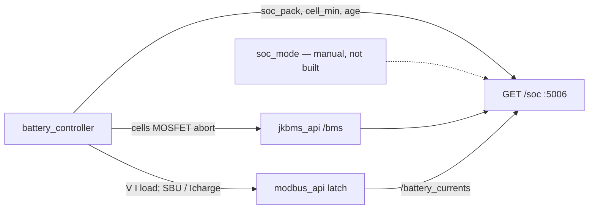
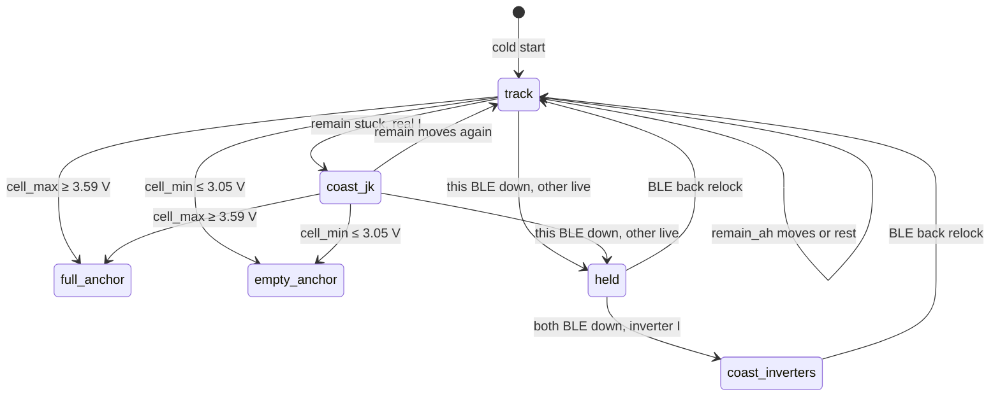

# Pack SoC control: estimator vs BMS-plugged backup

How pack SoC works after we stopped steering `battery_controller` from PowMr
`0x0100`. Charge/SBU policy: [`charge-control.md`](charge-control.md). Snapshot:
[`status.md`](status.md).

Implemented: the **estimator** path only (`GET /soc`). The PowMr-compat backup
`/soc` is specified here so it can be added later as a **manual** switch. Do
not auto-switch on BLE loss.

## Hardware: two different cables

| Link | What it carries | Unplug? |
|---|---|---|
| JK-BMS → PowMr **RS485** | Closed-loop BMS: SoC (`0x0100` while linked), charge requests | Optional. Plugged = old inverter SoC behaviour. Unplugged = PowMr must not honor JK % |
| Pi USB → PowMr **Modbus** | `0x0101` V, `0x0102` I, load, **writes** (SBU/UTI, charge current) | **Never** |
| Pi **BLE** → JK A/B | `remain_ah`, pack current, cells (query-only `0x96`/`0x97`) | Required for the estimator’s Track / Coast JK modes |

BLE down does **not** stop the JK coulomb counters. It only stops the Pi
from reading them. While RS485 is still plugged, PowMr `0x0100` is still
combined JK SoC (short tape). That is why “BLE down” and “previous
controller behaviour” are not the same outage.

PowMr `0x0101` / `0x0102` are the inverter’s own battery-port meter, not JK.
They should survive unplugging RS485. `0x0100` will not (junk or a voltage
table). We already see Est. SoC and `0x0100` diverge (e.g. ~53 % vs ~58 %).

## Two operator modes (manual)

These are **procedures you choose**, not automatic failovers.

| Mode | Cables | `/soc` meaning | Status |
|---|---|---|---|
| **estimator** (BMS unplugged / BLE active) | RS485 optional; BLE up for best quality | 260 Ah + 280 Ah tape; Track / Coast JK / Coast inverters / held | **Implemented** |
| **powmr_compat** (BMS plugged) | RS485 **plugged**; BLE may be dead | Old controller: `0x0100` + 5 s current interpolator + jump filter | **Not implemented** |

`battery_controller` always has **one** SoC client: `GET /soc`. It does not
know which mode produced the number. Switching modes (when backup exists)
must be a file or flag the estimator reads, not a compose recreate, and not
“BLE degraded.”



## What is implemented (estimator path)

### Estimator (`soc_estimator`, 10 s)

Per bank, usable Ah is config (`soc_estimator.yaml`: A 260, B 280), not JK
`nominal_ah` (A stuck ~196).

| Mode | When | Integration |
|---|---|---|
| **track** | BLE fresh, `remain_ah` moving with current | `remain_est += Δremain_jk` (offset held) |
| **coast_jk** | BLE fresh, remain stuck (99 % freeze, fake 0 % floor) | `remain_est += I_jk × Δt` |
| **coast_inverters** | **both** banks BLE down, latch has PowMr+Growatt I | split `I_pack` by last \|I\| share |
| **held** | this bank BLE down, the other live | freeze that bank’s `remain_est` |
| **full_anchor** | `cell_max ≥ 3.59 V` | `remain_est = usable` |
| **empty_anchor** | `cell_min ≤ 3.05 V` | `remain_est = 0` |

Cold start: `remain_est = remain_jk + max(0, usable − nominal_jk)`. Persist
`soc_estimator_state.json` (gitignored).

`GET /soc` (port **5006**) returns `soc_pack`, `source`, `cell_min` /
`cell_max`, per-bank remain/mode, `age_s`. Influx `soc_estimate` is the same
numbers (tag `source` per bank). The controller **does** steer from `/soc`.

Per-bank mode each 10 s tick (pack `source` is that mode, or `mixed` if A and
B disagree — Grafana graphs A/B only):



Anchors only on a **live** BLE sample. Both BLE down and no inverter I: `held`,
no Influx write, `/soc` ages out.

`/limited_registers` does **not** drive `/soc` in Track/Coast JK. It still
runs every 5 s because the controller needs V, I, load, and writes. The
current latch (`GET /battery_currents`) is filled from `/limited_registers`
(5 s, PowMr V/I) and `/registers` (30 s, Growatt 83/84). That latch is only
for **coast_inverters**.

Inverter-coast formula (charge-positive, same sign as the controller):

`I_pack ≈ I_powmr + I_growatt_charge − I_growatt_draw`

Do **not** subtract an extra static 100 W; idle already sits on those two
ports. If Growatt is missing from the latch, do not invent idle. If nothing
is measuring current, skip the Influx write; `/soc` still serves last remain
with growing `age_s`.

### Controller (`battery_controller`, 5 s)

1. Modbus: V, I, load (no longer requires `0x0100`).
2. `GET /soc` → `soc_pack`, `cell_min`.
3. `GET /bms` → abort if MOSFET off or `cell_max ≥ 3.55 V`.
4. Cheap / `sbu_fixed` / full-charge — [`charge-control.md`](charge-control.md).
5. Write SBU/UTI, grid current, Influx `charge_control`.

Removed from the controller (on purpose):

- 520 Ah interpolator clamped to `0x0100 ± 0.5 %`
- SoC jump filter (18↔24 when PowMr dropped a bank)

Those belonged to sanitizing `0x0100`. One-bank BLE dropout is `held` inside
the estimator.

**Controller fallback** (estimator HTTP down or `age_s > 30 s`):

- Hold last `soc_pack`.
- After 5 min still in SBU → `UTI_STOPPED`.
- **Never** fall back to `0x0100`.
- `cell_min` is ignored while the feed is stale (do not use an old knee).

Default state at boot is `UTI_STOPPED` until the first good `/soc`.

`daily_target` still writes `target_soc` as a percent. That percent is now of
**540 Ah**, not 476. The planner itself was not changed.

## Why BLE-down is not “previous behaviour”

The old controller never used Pi BLE. While RS485 is plugged, `0x0100` is
still JK’s combined % even if BLE is dead. That *is* previous behaviour, but
it cannot drive the 260/280 tape:

- `0x0100 ≈ (remain_A + remain_B) / (196 + 280)`. You cannot split that back
  into per-bank `remain_est`.
- Snapping `soc_pack` to `0x0100` jumps (observed ~53 % vs ~58 %).
- After RS485 is unplugged, `0x0100` is the wrong meter by design.

So BLE-down **without** flipping a manual mode stays on Est. SoC:
coast_inverters / held. That keeps coulomb counting on our tape (overnight
PowMr+Growatt vs JK residual was ~0 A). It does **not** resurrect `0x0100`.

## Backup mode (designed, not built)

Use only when BLE is **persistently** unusable **and** you have plugged RS485
back in. Completely manual.

Proposed switch: a file the estimator re-reads every tick, e.g.
`soc_mode.json`:

```json
{ "mode": "estimator" }
```

or `"powmr_compat"`. Logs should record the transition. No auto-detect of
cable or BLE.

When `powmr_compat`:

- Latch `0x0100` as well (already on the 5 s Modbus block; not latched today).
- `/soc` `soc_pack` = old interpolator: integer `0x0100`, plus `0x0102 × Δt`
  clamped to ±0.5 %, plus the ≥2 % / 60 s jump filter.
- `source`: `powmr_compat`.
- `cell_min`: null (no BLE cells) → controller skips the 3.05 V floor;
  pack voltage 49.4 V still applies.
- Yardstick is PowMr’s combined JK % (196+280), including fake 0 % on bank A.
  That is the point of “previous behaviour.”

**To enter backup:** plug RS485, confirm `0x0100` looks like combined JK SoC,
then set `powmr_compat`.

**To leave:** set `estimator`, then unplug RS485 if desired.

Setting `powmr_compat` with the cable **out** would feed a voltage table as
SoC. The system will not try to notice.

## Failures vs what the house does (estimator mode, as built)

| What died | `/soc` | Controller |
|---|---|---|
| Pi BLE (estimator up) | coast_inverters or held; still published | Uses `/soc` as usual |
| `soc_estimator` process | HTTP fails | Hold last Est. SoC; 5 min SBU → UTI_STOPPED |
| Modbus / PowMr USB | Latch ages out; Track/Coast JK still work | Hold writes; 5 min SBU → UTI_STOPPED (cannot change SBU/UTI anyway) |
| Influx / Grafana | Irrelevant | Irrelevant |

## Operator notes

- Phone JK app: single BLE client. Stop `jkbms_api` to use the app; BLE
  keep-alive will fight the phone if both try.
- Verify controller: `State:` / `est_SoC=` in `battery_controller` logs must
  match `GET /soc` `soc_pack`, not `0x0100`.
- Cheap night is the real test: SBU/UTI vs `target_soc` on Est. SoC, including
  Ah below JK A’s fake 0 %. Until RS485 is unplugged, **PowMr** may still
  switch to grid on JK ~9–10 % on its own.
- Do not unplug Pi USB Modbus. Without it the Pi cannot set SBU/UTI.

## Code map

| Piece | Role |
|---|---|
| `soc_estimator.py` | Tick + `GET /soc` + Influx `soc_estimate` |
| `soc_estimator.yaml` | Usable Ah, stale windows, persist path |
| `modbus_api.py` `GET /battery_currents` | Latch from existing polls; no extra RS485 |
| `battery_controller.py` | `/soc` + `/bms` abort + Modbus writes + `charge_control` |
| `jkbms_api.py` | Keep-alive BLE, `GET /bms` |

Grafana Real-Time gauge is Est. SoC. Graphs: Est pack/A/B; folded JK pack/A/B.
Output priority is under Load & Grid. SoC estimator row is source A/B.
